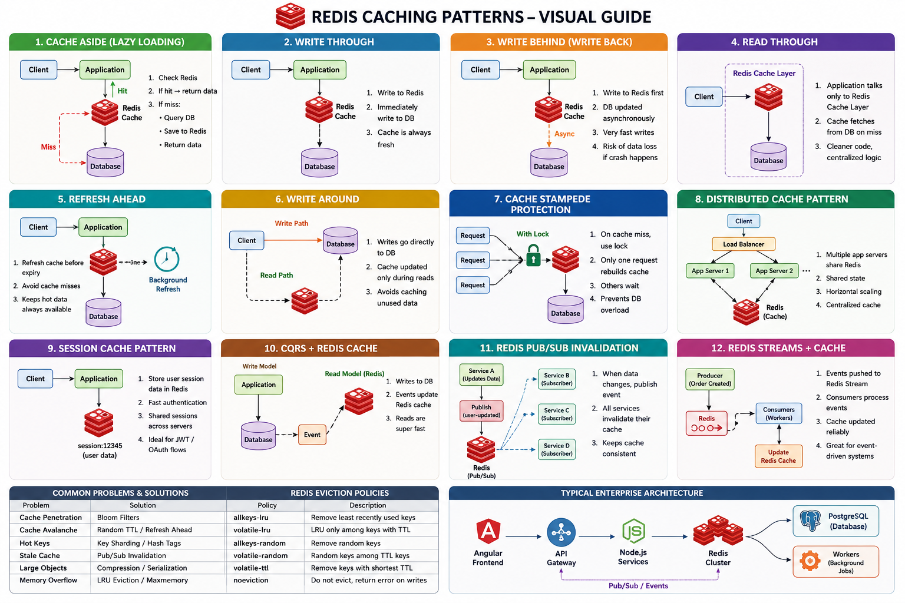

# Redis Common Caching Patterns
Redis caching patterns are common strategies used to improve application performance, reduce database load, and handle high traffic efficiently.



## Tutorials
1. Redis Cache : https://www.geeksforgeeks.org/system-design/redis-cache/
2. Caching Strategies | System Design Interview | Write-Through, Write-Back, Cache Aside, Read-Through : https://www.youtube.com/watch?v=Cm7gem9mBeg
3. REST API Caching Strategies Every Developer Must Know : https://www.youtube.com/watch?v=TV-xsNjbx_g

## Here are the most important Redis caching patterns used in real-world systems and interviews.

- **Cache-Aside (Lazy Loading):** The most common pattern. The application checks the cache first. If the data isn't there, it pulls it from the database, writes it to the cache, and returns it.
- **Write-Through:** The application writes to both the cache and the primary database simultaneously, ensuring the cache always has the latest data.
- **Write-Behind:** The application writes immediately to the cache, returning success to the user. An asynchronous process updates the primary database later.
- **Read-Through:** Configures the cache itself to handle reading from the underlying database automatically when a cache miss occurs.

### 1. Cache Aside (Lazy Loading)

Most commonly used pattern.

Application checks cache first.
```
If data is missing → fetch from DB → store in Redis → return response.
```

**Flow**
```
Client
  ↓
Application
  ↓
Redis Cache
   ↙ miss
Database
```

**Steps**
1. Check Redis
2. If hit → return data
3. If miss:
    - Query DB
    - Save to Redis
    - Return data

**Example**
```
async function getUser(id: string) {
  const cached = await redis.get(`user:${id}`);

  if (cached) {
    return JSON.parse(cached);
  }

  const user = await db.users.findById(id);

  await redis.set(
    `user:${id}`,
    JSON.stringify(user),
    "EX",
    3600
  );

  return user;
}
```

**Advantages**
- Simple
- Cost efficient
- Only cache frequently accessed data

**Problems**
- Cache miss latency
- Stale data possible

**Real-world use**
- User profiles
- Product pages
- Angular dashboard APIs

### 2. Write Through Cache

Write to cache and DB together.

**Flow**
```
Application
   ↓
Redis Cache
   ↓
Database
```

**Steps**
- App updates cache
- Cache immediately updates DB

**Example**
```
await redis.set(`user:${id}`, JSON.stringify(user));
await db.users.update(user);
```

**Advantages**
- Cache always fresh
- Faster reads

**Problems**
- Higher write latency
- Unused data also cached

**Use cases**
- Banking systems
- Session data
- Frequently read data

### 3. Write Behind (Write Back)

Writes go to Redis first.   
DB updated asynchronously later.

**Flow**
```
Application
   ↓
Redis
   ↓ async
Database
```

**Advantages**
- Very fast writes
- High throughput

**Problems**
- Risk of data loss
- Complex consistency

**Use cases**
- Analytics
- Logging systems
- IoT telemetry

### 4. Read Through Cache

Cache itself fetches data from DB automatically.

Application talks only to cache.

**Flow**
```
Application
    ↓
Redis Layer
    ↓
Database
```
Usually implemented using custom middleware.

**Advantages**
- Cleaner app code
- Centralized caching logic

**Problems**
- More infrastructure complexity

### 5. Refresh Ahead Cache

Refresh cache before expiry.

**If data is frequently accessed:**
- refresh TTL automatically
- avoid cache miss

**Example**
```
TTL remaining < 2 mins
→ background refresh
```

**Use cases**
- Trending products
- Live dashboards
- Stock prices

### 6. Write Around Cache

Writes go directly to DB.  
Cache updated only during reads.  

**Flow**
```
Write → DB only
Read → Cache Aside
```

**Advantages**
- Avoids caching unused data

**Problems**
- First read slower
- Use cases
- Large datasets
- Rarely read records

### 7. Cache Stampede Protection

Prevents multiple requests from hitting DB simultaneously when cache expires.

**Problem**
```
1000 requests
Cache expired
All hit DB together
DB crashes
```

**Solutions**
Mutex Lock
```
Only one request rebuilds cache
Others wait
```
Probabilistic Expiry
```
Randomize TTL.
```
Background Refresh
```
Refresh before expiry.
```

### 8. Distributed Cache Pattern

Multiple application servers share same Redis cache.

**Architecture**
```
Angular App
      ↓
Load Balancer
   ↓      ↓
Node1   Node2
    \    /
     Redis
```

**Benefits**
- Shared state
- Horizontal scaling
- Centralized sessions

### 9. Session Cache Pattern

Store user sessions in Redis.

**Example**
```
session:12345 → user data
```

**Benefits**
- Fast authentication
- Shared sessions across servers
- Works well with JWT refresh flows

**Used heavily with:**
- Node.js
- Angular
- OAuth2/OIDC systems

### 10. CQRS + Redis Cache

Redis used as optimized read model.

**Architecture**
```
Write DB → Event → Redis Read Cache
```
Reads become extremely fast.

**Use cases**
- E-commerce
- Analytics
- Real-time dashboards

### 11. Redis Pub/Sub Cache Invalidation

**When data changes:**
- publish invalidation event
- all services clear cache

**Example**
```
user-updated event
→ clear user cache everywhere
```

Useful in:
- Microservices
- Distributed systems

### 12. Redis Streams + Cache

Use Redis Streams for reliable event processing.

**Example**
```
Order Created
   ↓
Redis Stream
   ↓
Consumers update cache
```

**Good for:**
- Event-driven systems
- Real-time pipelines

## Production Problems & Solutions
| Problem           | Solution             |
| ----------------- | -------------------- |
| Cache penetration | Bloom filters        |
| Cache avalanche   | Random TTL           |
| Hot keys          | Sharding             |
| Stale cache       | Pub/Sub invalidation |
| Large objects     | Compression          |
| Memory overflow   | LRU eviction         |

## Which Pattern Should You Use?
| Scenario                  | Best Pattern         |
| ------------------------- | -------------------- |
| General APIs              | Cache Aside          |
| Heavy reads               | Write Through        |
| Massive writes            | Write Behind         |
| Real-time systems         | Refresh Ahead        |
| Distributed microservices | Pub/Sub invalidation |
| Event systems             | Streams + Cache      |

## Interview Tips

Most companies expect knowledge of:
- Cache Aside
- TTL strategy
- Cache invalidation
- Stampede prevention
- Redis clustering
- LRU eviction
- Distributed caching
- Pub/Sub invalidation


