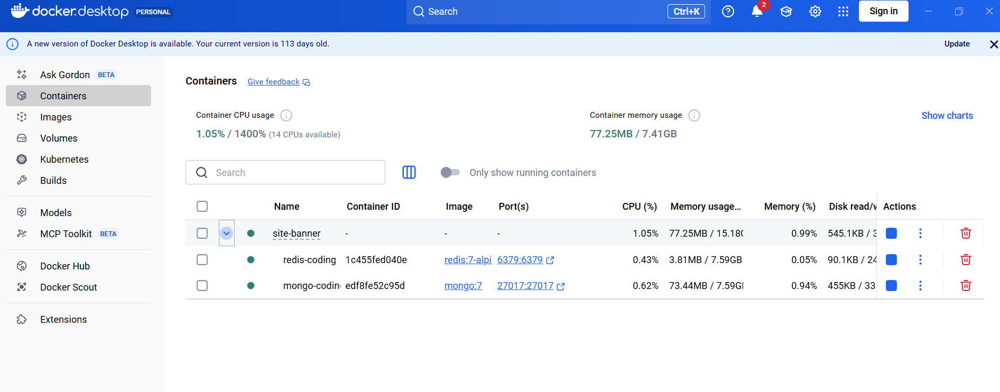
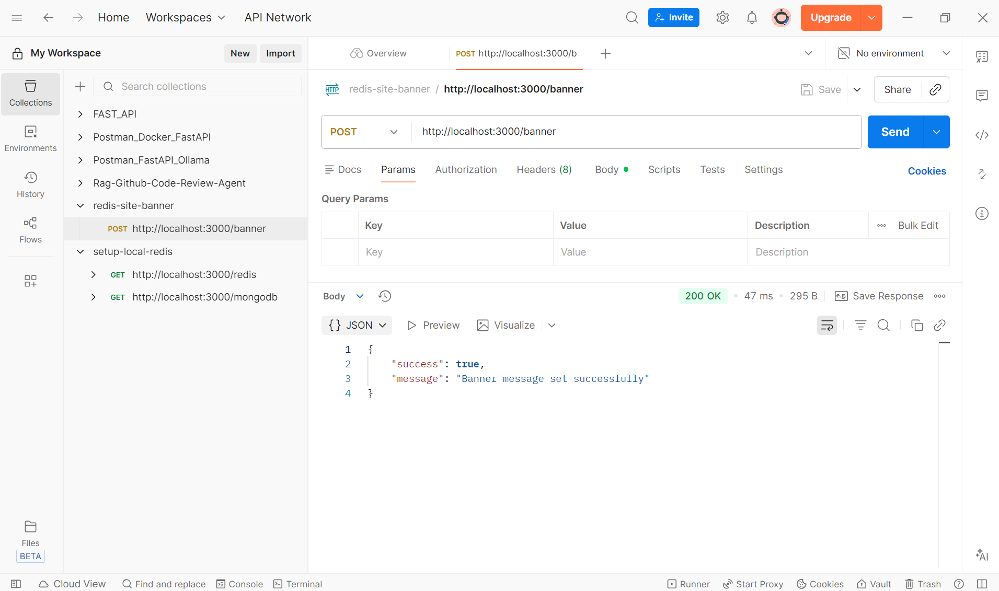
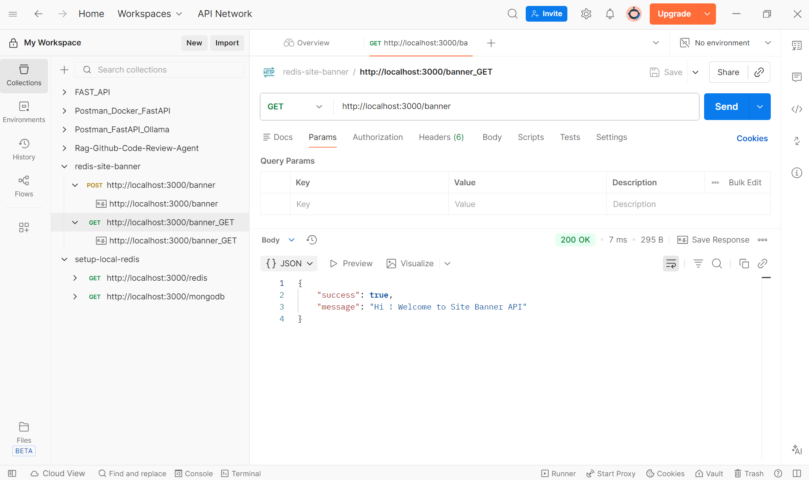
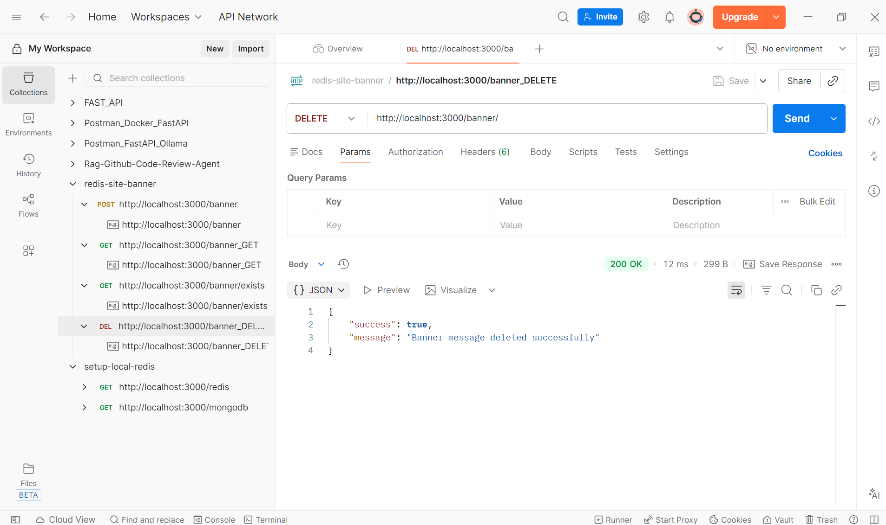
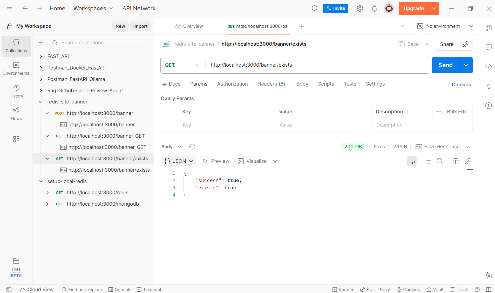

## Tutorial
Site banner APIs with Redis : https://www.youtube.com/watch?v=kYeDJhA4XIw

## Run
1. install bun if not present in your local machine
```
npm install -g bun
```
2. install package.json 
```
bun i
```
3. Run Docker
```
docker compose up -d
```


4. Run Nodejs
```
npm run dev
```

5. Test in Postman
in Postman, you can test this endpoint by sending a POST request to http://localhost:3000/banner


in Postman, you can test this endpoint by sending a GET request to http://localhost:3000/banner


in Postman, you can test this endpoint by sending a DELETE request to http://localhost:3000/banner


in Postman, you can test this endpoint by sending a GET request to http://localhost:3000/banner/exists
