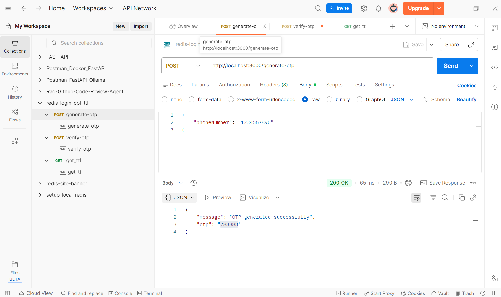
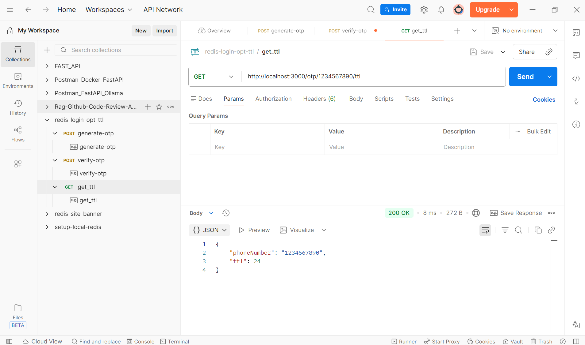
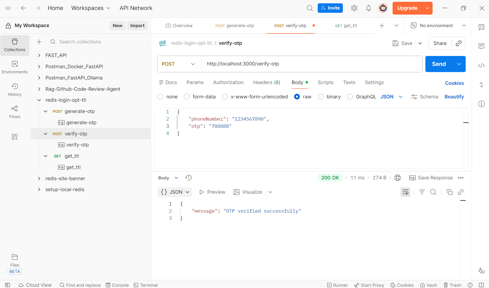
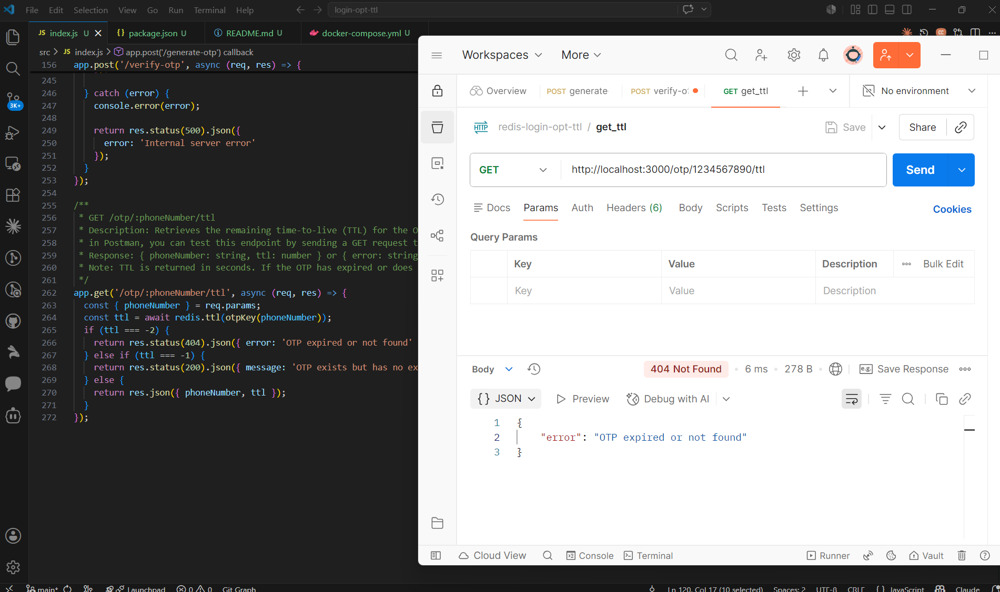

## Tutorial
Building a OTP verification with Redis : https://www.youtube.com/watch?v=MlxmA5_cc_Y

## Run
1. install bun if not present in your local machine
```
npm install -g bun
```
2. install package.json 
```
bun i
```
3. Run Docker
```
docker compose up -d
```


4. Run Nodejs
```
npm run dev
```

5. Test in Postman (TTL = 60 seconds)

in Postman, create OTP by triggering the endpoint by sending a POST request to http://localhost:3000/generate-otp with a JSON body like:


Now, you have 60 seconds remaining to test ttl & otp-verification endpoints to get success message

in Postman, now trigger this endpoint by sending a GET request to http://localhost:3000/otp/{phoneNumber}/ttl (replace {phoneNumber} with the actual phone number you used to generate the OTP).

ttl: 24 means: 24 seconds remaining before the OTP expires

in Postman, now trigger this endpoint by sending a POST request to http://localhost:3000/verify-otp with a JSON body like:


Otp verification is successful because we provided correct otp within 60 seconds

Now again after 60 seconds, trigger this endpoint by sending a GET request to http://localhost:3000/otp/{phoneNumber}/ttl (replace {phoneNumber} with the actual phone number you used to generate the OTP).

getting error because 60 seconds already expired.

now again, trigger this endpoint by sending a POST request to http://localhost:3000/verify-otp with a JSON body like:



## Why This Version is Better

The better Redis OTP structure with:
- OTP value
- Attempt tracking
- Max retry limit
- Created time
- Last attempt time
- Temporary lock mechanism

You should store OTP data like this in Redis:
```
{
  otp: "483921",
  attempts: 0,
  maxAttempts: 3,
  createdAt: timestamp,
  lastAttemptAt: timestamp,
  lockedUntil: timestamp // optional
}
```
Here’s a much better production-style implementation using Express + Redis.

1. Brute-force protection

After 3 wrong attempts:
```
lockedUntil: future timestamp
```
User gets temporarily blocked.

2. Tracks attempts
```
attempts: 0
```
Important for banking/security apps.

3. Preserves TTL

OTP still expires automatically in Redis.

4. Prevents OTP reuse

After successful verification:
```
await redis.del(key)
```

## Permanent Security/Audit Data → Database

Production apps usually save metadata for:
- fraud detection
- analytics
- compliance
- abuse prevention
- customer support
- security investigations

But they usually do NOT store the actual OTP permanently.

What Is Commonly Saved Permanently :

OTP Request Logs

**Example MongoDB/Postgres document:**
```
{
  "phoneNumber": "+91XXXXXX123",
  "generatedAt": "2026-05-16T10:30:00Z",
  "ipAddress": "49.xxx.xxx.xxx",
  "deviceId": "android-123",
  "status": "SENT"
}
```

**Verification Attempts**
```
{
  "phoneNumber": "+91XXXXXX123",
  "attemptTime": "2026-05-16T10:31:00Z",
  "success": false,
  "ipAddress": "49.xxx.xxx.xxx"
}
```

**Fraud Monitoring**
```
{
  "phoneNumber": "+91XXXXXX123",
  "failedAttempts": 12,
  "blocked": true,
  "country": "IN"
}
```

| Data            | Storage           | TTL           |
| --------------- | ----------------- | ------------- |
| OTP value       | Redis             | 2–5 mins      |
| Attempt counter | Redis             | same as OTP   |
| Session token   | Redis             | minutes/hours |
| User account    | MongoDB/Postgres  | permanent     |
| OTP logs        | DB/Data warehouse | permanent     |
| Fraud analytics | DB                | permanent     |

**Banking / Enterprise Systems Also Store**
- device fingerprint
- SIM/device changes
- geolocation
- IP reputation
- carrier information
- request frequency
- jailbreak/root detection

before allowing OTP verification.

## Production OTP Flow
```
User enters phone number
        ↓
Generate OTP
        ↓
Save temporary OTP in Redis
        ↓
Save audit log in DB
        ↓
Send SMS
        ↓
User enters OTP
        ↓
Verify from Redis
        ↓
Delete OTP after success
        ↓
Store verification event in DB
```

## Real Banking Flow

Usually:
```
Client
   ↓
API Gateway
   ↓
Auth Service
   ↓
Redis OTP Store
   ↓
SMS Provider (Twilio/Fast2SMS/etc.)
```

Redis is used because:
- ultra fast
- in-memory
- TTL support
- distributed
- scalable

Perfect for OTP systems.