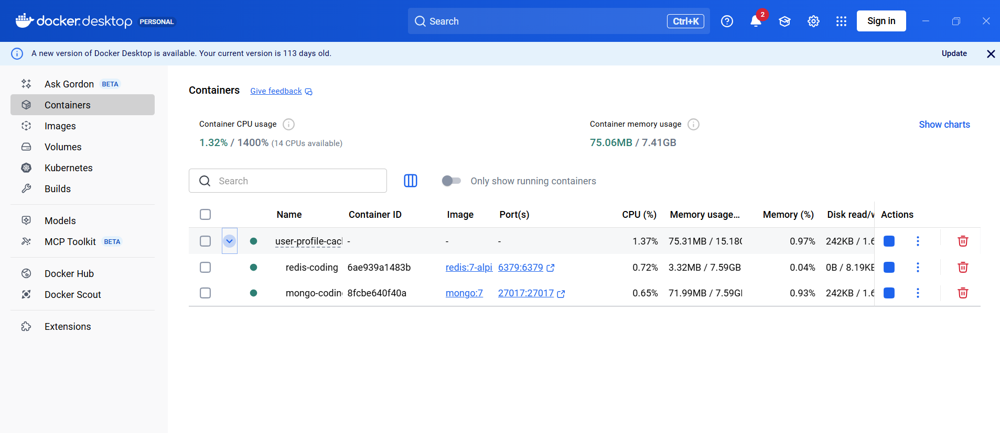
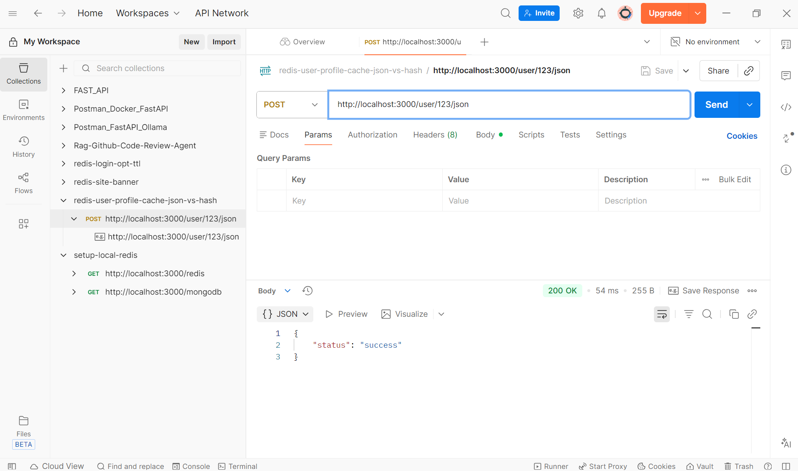
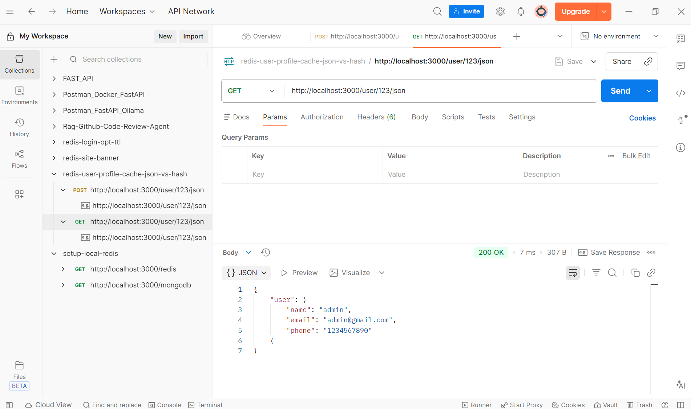
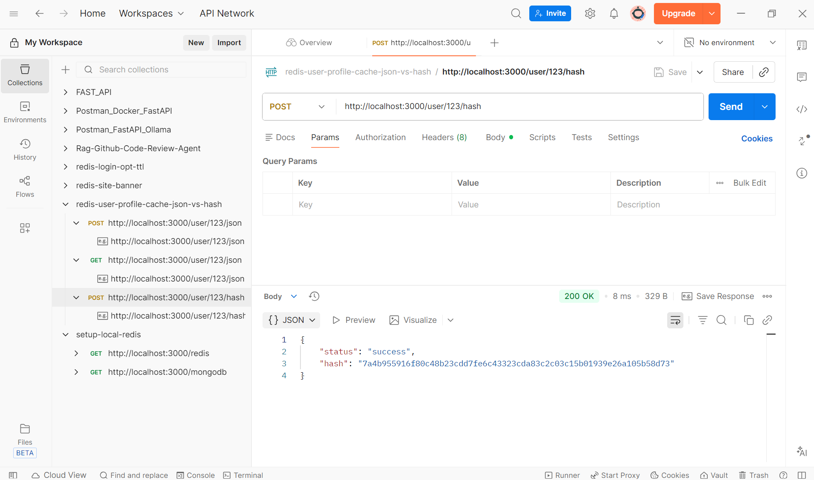
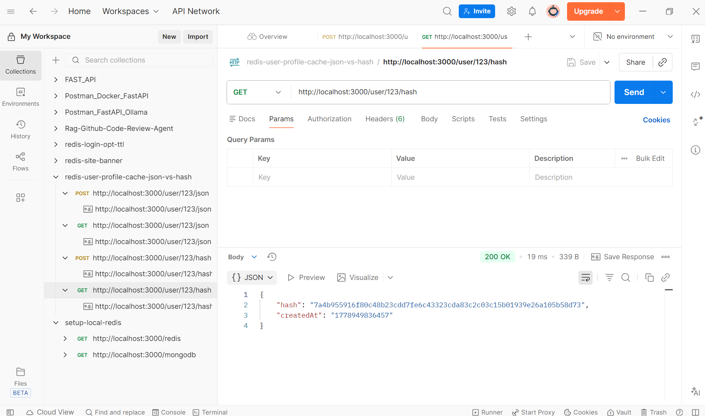

## Tutorial
User profile in Redis JSON vs HASH : https://www.youtube.com/watch?v=MFnK1PRABDU

## Run
1. install bun if not present in your local machine
```
npm install -g bun
```
2. install package.json 
```
bun i
```
3. Run Docker
```
docker compose up -d
```


4. Run Nodejs
```
npm run dev
```

5. Test in Postman (TTL = 60 seconds)

in Postman, POST /user/:id/json: Stores user data as JSON string in Redis


in Postman, GET /user/:id/json: Retrieves user data as JSON string from Redis.


in Postman, POST /user/:id/hash: Stores a hash of the user data in Redis.


in Postman, GET /user/:id/hash: Retrieves the hash of the user data from Redis.


## Redis Commands popular
- set (Store a value)
- get (Retrieve a value)
- del (Delete a key)
- exists (Check whether a key exists)
- expire (Set expiration time in seconds)
- ttl (Get remaining expiration time)
- incr (Increment numeric value by 1)
- decr (Decrement numeric value by 1)
- hset (Store fields inside a hash)
- hgetall (Retrieve all fields from a hash)
- hdel (Delete field(s) from a hash)
- lpush (inser left)
- rpush (insert right)
- lpop (remove 1st item)
- lrange (Get list items)

1. SET → Store Simple String Value

Stores one value against one key.

Example
```
await redis.set(
  'otp:1234567890',
  '483921'
);
```

Redis stores:
```
Key   → otp:1234567890
Value → "483921"
```

Get Value
```
const otp = await redis.get(
  'otp:1234567890'
);
```

Common Use Cases
- OTP
- JWT token
- cache
- session id
- feature flags

With Expiry
```
await redis.set(
  'otp:1234567890',
  '483921',
  'EX',
  30
);
```
Expires in 30 seconds.

2. HSET → Store Hash/Object

Redis Hash = like a JavaScript object.

Instead of storing one string, you store fields.

Example
```
await redis.hset(
  'otp:1234567890',
  {
    otp: '483921',
    attempts: 0,
    createdAt: Date.now()
  }
);
```

Redis internally:
```
Key: otp:1234567890

Fields:
  otp → 483921
  attempts → 0
  createdAt → 1747400000
```

Get Single Field
```
const otp = await redis.hget(
  'otp:1234567890',
  'otp'
);
```

Update Field
```
await redis.hset(
  'otp:1234567890',
  'attempts',
  1
);
```
Common Use Cases
user session
profile cache
cart data
OTP metadata
counters
3. HGETALL → Read Entire Hash

Gets all fields from a Redis hash.
```
Example
const data = await redis.hgetall(
  'otp:1234567890'
);
```
Output:
```
{
  "otp": "483921",
  "attempts": "0",
  "createdAt": "1747400000"
}
```
IMPORTANT: Redis returns everything as strings.

So:
```
Number(data.attempts)
```
may be needed.
