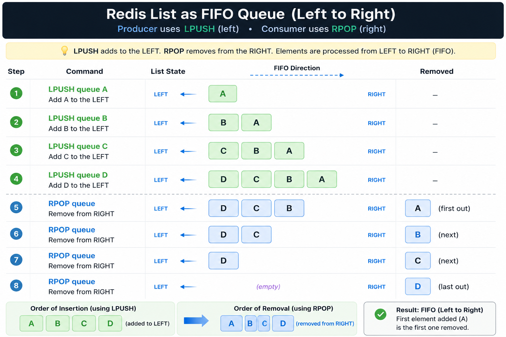
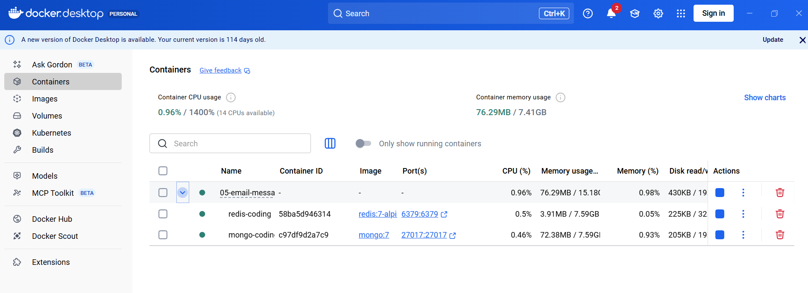
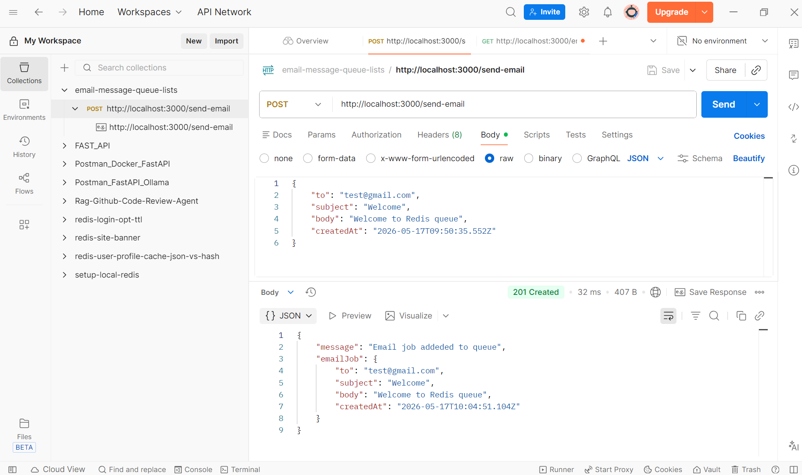
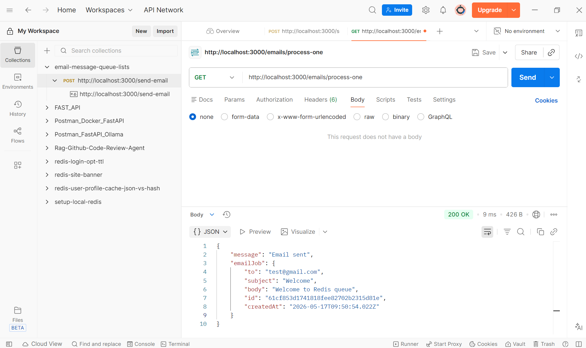

## Tutorial
Email queue with redis lists : https://www.youtube.com/watch?v=r005ciJ55DY

## Redis Lists (Email Message Queue)
Lists are ideal for straightforward, lightweight FIFO (First-In, First-Out) queues.
- **How it works:** A producer adds items to one end of the list, and a consumer removes them from the other.
- **Blocking Operations:** Using BRPOP (Blocking Right Pop) allows the consumer to "wait" for a new message without constantly polling the server, saving CPU resources
- **Commands:** LPUSH to enqueue and RPOP or BRPOP to dequeue.

## Why Use Redis as a Message Queue?
Redis is a powerful choice for a message queue, particularly in systems where speed and simplicity are paramount. Here’s why Redis excels in this role:

- High Performance: Redis operates entirely in-memory, making it capable of handling high volumes of messages with low latency.
- Efficient Data Handling: By storing essential metadata (like message IDs) in the queue and full details in separate hashes, Redis minimizes memory usage while maintaining the speed and efficiency of message delivery.
- Scalability: Redis supports clustering and sharding, allowing the system to scale as message volumes grow.
- Flexibility: Redis can be tailored to fit various queuing models, including FIFO (First-In, First-Out) and more complex workflows.

## Redis Queue Basics
Redis provides several commands that can be used to implement a basic queue. The primary data structure used for this purpose is the Redis List, which is a list of strings sorted by the order of insertion. You can add elements to a Redis List on the head (left) or on the tail (right).

Enqueueing is the process of adding an element to the queue. In Redis, you can use the
```
LPUSH
```
Dequeuing is the process of removing an element from the queue. In a queue, the element that was added first is removed first (FIFO). In Redis, you can use the
```
RPOP
```


In another way, we can also used FIFO with Right to Left
```
RPUSH
LPOP
```


## Run
1. install bun if not present in your local machine
```
npm install -g bun
```
2. install package.json 
```
bun i
```
3. Run Docker
```
docker compose up -d
```


4. Run Nodejs
```
npm run dev
```

5. Test in Postman (TTL = 60 seconds)

in Postman, POST http://localhost:3000/send-email add the job to the left of the list in Redis


in Postman, POST http://localhost:3000/emails/process-one add the job to the left of the list in Redis


## Problem With Basic Redis Queue
If you use:
```
LPUSH
RPOP
```
directly as a queue, then:
| Problem                | Explanation               |
| ---------------------- | ------------------------- |
| Job loss               | worker crashes after pop  |
| No retry               | failed jobs disappear     |
| No dead-letter queue   | failed jobs lost forever  |
| No scheduling          | cannot delay jobs easily  |
| Weak observability     | no dashboard              |
| No guaranteed delivery | depends on implementation |

### Production Solution

Use Redis + Queue Library.

**Popular choices:**

| Library | Ecosystem |
| ------- | --------- |
| BullMQ  | Node.js   |
| Bull    | Node.js   |
| Celery  | Python    |
| Sidekiq | Ruby      |
| RQ      | Python    |