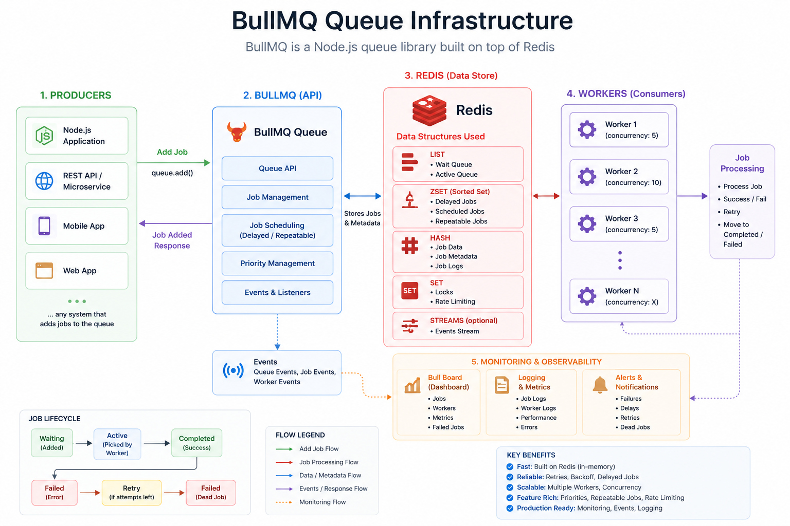

## Tutorial
Email queue with redis lists : https://www.youtube.com/watch?v=r005ciJ55DY
BullMQ : https://docs.bullmq.io/readme-1

## BullMQ queue architecture diagram


## Run
1. install bun if not present in your local machine
```
npm install -g bun
```
2. install package.json 
```
bun i
```
3. Run Docker
```
docker compose up -d
```


4. Run Nodejs
```
npm run dev
```

5. Test in Postman (TTL = 60 seconds)

in Postman, POST /user/:id/json: Stores user data as JSON string in Redis


in Postman, GET /user/:id/json: Retrieves user data as JSON string from Redis.


in Postman, POST /user/:id/hash: Stores a hash of the user data in Redis.


in Postman, GET /user/:id/hash: Retrieves the hash of the user data from Redis.


## Can use Redis as EMail Queue even if Redis have issue like 1. job loss 2. no retry 3. no parallel workers
Yes, Redis can be used as an email queue, and many production systems do use it.

Problem With Basic Redis Queue
-----------------------------------------------------
If you use:
```
LPUSH
RPOP
```
directly as a queue, then:
| Problem                | Explanation               |
| ---------------------- | ------------------------- |
| Job loss               | worker crashes after pop  |
| No retry               | failed jobs disappear     |
| No dead-letter queue   | failed jobs lost forever  |
| No scheduling          | cannot delay jobs easily  |
| Weak observability     | no dashboard              |
| No guaranteed delivery | depends on implementation |

So plain Redis lists alone are NOT ideal for production email queues.

Production Solution
-----------------------------------------------------
Use Redis + Queue Library.

Popular choices:

| Library | Ecosystem |
| ------- | --------- |
| BullMQ  | Node.js   |
| Bull    | Node.js   |
| Celery  | Python    |
| Sidekiq | Ruby      |
| RQ      | Python    |


BullMQ : Built on Redis.

Supports:
- retries
- delayed jobs
- concurrency
- worker scaling
- job persistence
- failed queue
- rate limiting
- scheduling
- priorities

Production-grade.

```
API Server
    ↓
BullMQ Queue
    ↓
Redis
    ↓
Multiple Workers
    ↓
SMTP / Email Provider
```

**Now Your Earlier Problems Are Solved**
| Problem          | BullMQ Solution   |
| ---------------- | ----------------- |
| Job loss         | persisted jobs    |
| Retry            | automatic retries |
| Parallel workers | concurrency       |
| Delayed jobs     | built-in          |
| Failed jobs      | failed queue      |
| Monitoring       | Bull Board        |
| Rate limiting    | built-in          |

### Parallel Workers

You mentioned: no parallel workers

BullMQ supports:
```
concurrency: 50
```
and multiple worker processes.

Example:
```
Worker 1
Worker 2
Worker 3
```
all consume jobs simultaneously.

Very common in:
- email systems
- OTP delivery
- video processing
- AI pipelines

## Retry Example
```
attempts: 5
```
If SMTP fails:
```
retry automatically
```
with exponential backoff.

### Real Production Email Stack

Usually:
```
API
 ↓
Redis Queue (BullMQ)
 ↓
Workers
 ↓
SMTP Provider
   - SendGrid
   - SES
   - Mailgun
```

### Can Redis Alone Be Enough?

For small apps:
```
YES
```
using:
- LPUSH
- BRPOP

But for serious production systems:
```
Use BullMQ or RabbitMQ/Kafka
```

## Recommended for Your Stack

Since you're already using:
```
Node.js
Redis
Docker
```

Best next step:
```
BullMQ + Redis
```

Perfect for:
- email queue
- OTP sending
- notifications
- background jobs
- async processing