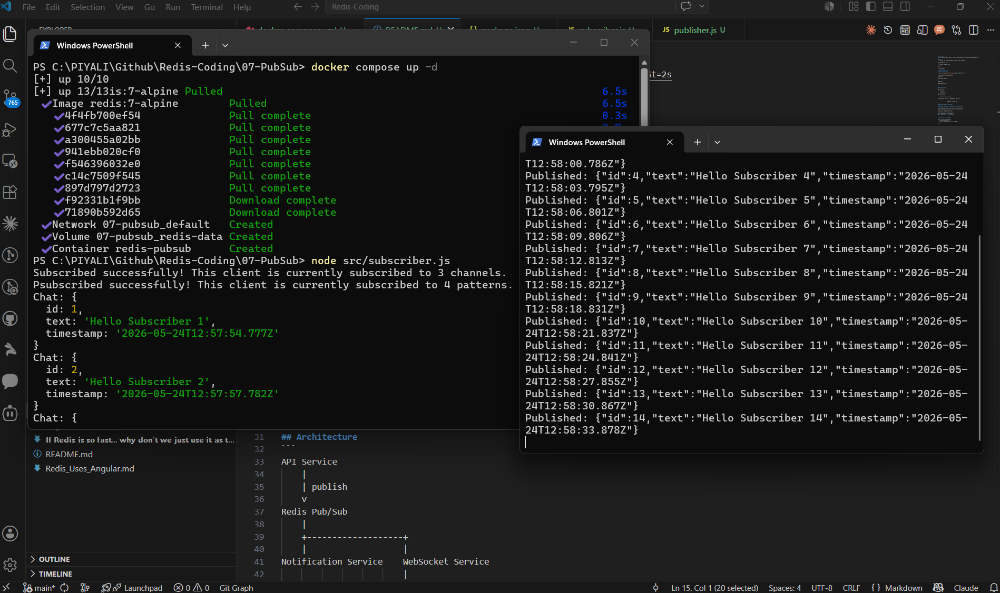

## Tutorial
1. Build a pub sub with Redis : https://www.youtube.com/watch?v=0Y6PbN4NEz0&t=2s
2. Redis Pub/sub : https://redis.io/docs/latest/develop/pubsub/
3. Pub/Sub use cases : https://redis.io/glossary/pub-sub/

Redis Pub/Sub is a lightweight, real-time messaging model where publishers send messages to named channels and all active subscribers receive them instantly. It operates on a "fire and forget" and at-most-once delivery system—if a subscriber is offline, they will permanently miss the message.

## If You Need Message Persistence
Use Redis Streams instead of Pub/Sub. Redis Streams store messages permanently.

## How It Works
- Publishers : Broadcast messages to a specific channel without knowing who (or how many) clients are listening.
- Subscribers: Listen to one or more channels and immediately receive any new messages broadcasted while they are connected.
- Patterns: Supports pattern matching (e.g., listening to updates.* to catch multiple channel variations).

1. SUBSCRIBE [channel-name] – Listens to a specific channel.
2. PUBLISH [channel-name] [message] – Sends a message to all subscribers of the channel.
3. PSUBSCRIBE [pattern] – Subscribes to channels matching a glob-style pattern

## Run
1. install bun if not present in your local machine
```
npm install -g bun
```
2. install package.json 
```
bun i
```
3. Run Docker
```
docker compose up -d
```

4. Run subscriber & publisher

CMD or Terminal 1 - Subscriber First ✅
```
node src/subscriber.js
```

CMD or Terminal 2
```
node src/publisher.js
```




## Architecture
```
API Service
    |
    | publish
    v
Redis Pub/Sub
    |
    +-------------------+
    |                   |
Notification Service    WebSocket Service
                        |
                        v
                  Angular / React UI
```

## Production Best Practices
```
Publisher  --->  Redis Channel  --->  Subscriber

subscribe()  = listen to channel
on()         = react to events
```
Redis simply broadcasts messages to currently connected subscribers.

Separate Publisher & Subscriber Connections
----------------------------------------------------------------------------
Redis Pub/Sub connections enter subscriber mode.

Always use separate clients:
```
const publisher = new Redis();
const subscriber = new Redis();
```

subscriber.subscribe()
----------------------------------------------------------------------------
This tells Redis: “I want to listen to this channel.” It registers the subscription.

Example
```
subscriber.subscribe('chat-room', 'notifications', 'emails', (err, count) => {
```
After this:
```
subscriber is connected to channels: chat-room, notifications, emails
```
Without subscribe(), Redis will NOT send messages.

subscriber.on()
----------------------------------------------------------------------------
This listens for events in Node.js.

It handles incoming messages/events.

Example
```
subscriber.on("message", (channel, message) => {
  console.log(channel, message);
});
```
This means:
```
“When a message event happens, run this callback.”
```

Real Analogy
----------------------------------------------------------------------------
**subscribe()**

Like subscribing to a YouTube channel.
```
"Send me notifications from this channel"
```

**on("message")**

Like handling the notification when it arrives.
```
"Oh, a new video arrived"
```

Event Flow
----------------------------------------------------------------------------
```
subscribe("chat-room")
        ↓
Redis registers subscriber
        ↓
publisher.publish(...)
        ↓
Redis pushes message
        ↓
on("message") executes callback
```

Enable Retry Strategy
----------------------------------------------------------------------------
```
const redis = new Redis({
  retryStrategy(times) {
    return Math.min(times * 50, 2000);
  },
});
```

Pub/Sub with JSON Messages
----------------------------------------------------------------------------
```
subscriber.on("message", (channel, message) => {
  const data = JSON.parse(message);

  console.log(data.id);
  console.log(data.text);
});
```

## Multiple Events with on()

on() handles many Redis connection events.

**Message Event**
```
subscriber.on("message", (channel, message) => {
  console.log(message);
});
```

**Connect Event**
```
subscriber.on("connect", () => {
  console.log("Redis connected");
});
```

**Error Event**
```
subscriber.on("error", (err) => {
  console.error(err);
});
```

**Close Event**
```
subscriber.on("close", () => {
  console.log("Connection closed");
});
```

## Important Limitation of Redis Pub/Sub

Redis Pub/Sub is:
- Fire-and-forget
- No persistence
- Messages lost if subscriber offline

For guaranteed delivery use:
- Redis Streams
- Kafka
- RabbitMQ
- NATS

## Real Production Pattern

**Most systems use:**
```
Redis Pub/Sub
    ↓
WebSocket Broadcasting
```
for live notifications.

**But for reliable event processing:**
```
Redis Streams
Kafka
RabbitMQ
```
are preferred.

## Pub/Sub vs Streams
| Feature         | Pub/Sub | Streams         |
| --------------- | ------- | --------------- |
| Real-time       | ✅       | ✅               |
| Persistent      | ❌       | ✅               |
| Replay messages | ❌       | ✅               |
| Consumer groups | ❌       | ✅               |
| Fastest         | ✅       | Slightly slower |
| Durable         | ❌       | ✅               |

