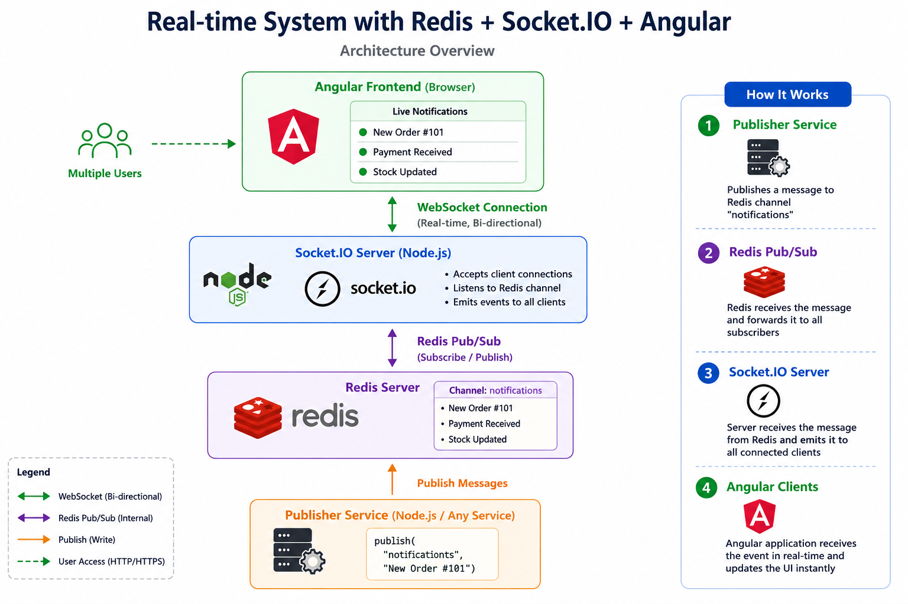
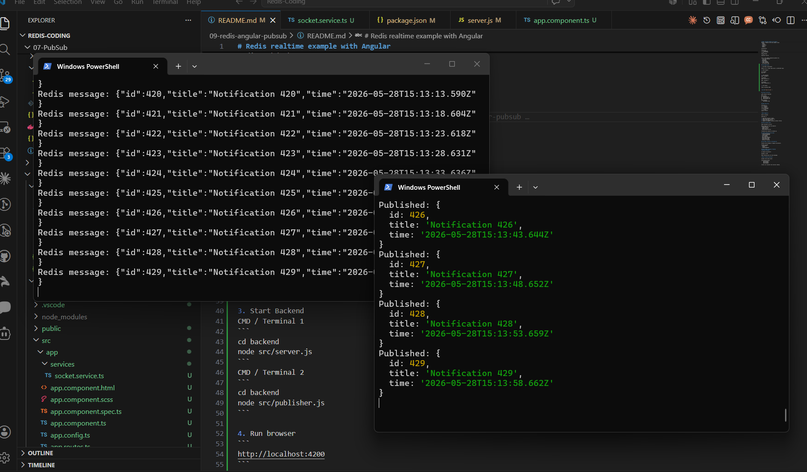
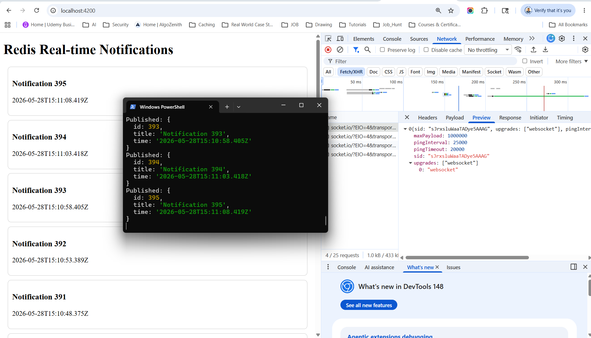

# Real-time System with Redis PUB/SUB + Socket.io + Angular



Here’s a complete real-time example using:
- Redis
- ioredis
- Socket.IO
- Angular
- Node.js

Architecture:
```
Angular UI
    ↕ WebSocket
Socket.IO Server
    ↕
Redis Pub/Sub
    ↕
Publisher Service
```

## How Pub/Sub Works
```
Publisher  --->  Redis Channel  --->  Subscriber
```
Redis simply broadcasts messages to currently connected subscribers.

## Limitation of Redis Pub/Sub
- transient
- fire-and-forget
- no persistence
- no acknowledgment
- no replay

It behaves like live radio broadcasting. If radio was playing before you tuned in, you missed it.

## Run Application

1. Run Redis using Docker
```
docker run -d --name redis-server -p 6379:6379 redis
```

2. Start Angular
```
cd frontend
npm start
```

3. Start Backend
CMD / Terminal 1
```
cd backend
node src/server.js
```
CMD / Terminal 2
```
cd backend
node src/publisher.js
```



4. Run browser 
```
http://localhost:4200
```

**Expected Angular UI**
```
Live updates every 5 seconds without refresh.
``` 


## What Happens

Every 5 seconds:
```
publisher.js
```
publishes message to Redis.

Redis subscriber receives it.

Socket.IO broadcasts it.

Angular UI updates instantly without refresh.


## Project Structure
```
redis-angular-realtime/
│
├── backend/
│   ├── server.js
│   ├── publisher.js
│   └── package.json
│
└── frontend/
    └── Angular app
```

## Real-Time Flow
```
publisher.js
     ↓ publish
Redis Channel
     ↓ subscribe
Socket.IO Server
     ↓ emit
Angular Browser
```

**What Happens**

Every 5 seconds:
```
publisher.js
```
1. publishes message to Redis.
2. Redis subscriber receives it.
3. Socket.IO broadcasts it.
4. Angular UI updates instantly without refresh.

## Why Use Redis Here?

Redis decouples services.

Many backend services can publish:
- Order Service
- Payment Service
- Email Service
- Notification Service

Frontend only connects to Socket.IO.

## Common Enterprise Use Cases
- Live notifications
- Trading dashboards
- Chat systems
- IoT telemetry
- Real-time analytics
- Multiplayer games
- Admin monitoring
- Delivery tracking

## Use Redis Streams for Reliability

Pub/Sub loses messages if Angular disconnects.

Streams provide:
- persistence
- replay
- acknowledgements

## Why Streams Instead of Pub/Sub
**Pub/Sub Problem**

If Angular disconnects:
```
message is LOST
```
Redis Pub/Sub does not store messages.

**Redis Streams Solution**

Streams store every event:
```
notification-stream
    ├── message-1
    ├── message-2
    ├── message-3
```
Clients can reconnect and continue reading.