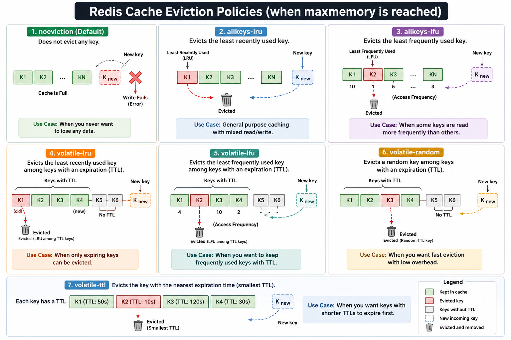

# Cache Eviction or Expiration strategy



Caching in System Design Interviews w/ Meta Staff Engineer : https://www.youtube.com/watch?v=1NngTUYPdpI

**1. Need Freshness → TTL (Time To Live)**
```
User Data
    ↓
Redis (TTL = 5 min)
    ↓
Auto Expire
```

Use when:
- Product prices
- Stock market data
- Weather APIs
- Session tokens

Interview answer: "If data freshness is important, I use TTL-based caching so stale data automatically expires."

**2. Want to Keep Recent Data → LRU (Least Recently Used)**
```
Cache Full

[A] [B] [C] [D]

User accesses:
B → C → D

A becomes oldest

New item E arrives

Evict A
```

Redis policy: allkeys-lru

Use when:
- User profiles
- Product catalog
- Frequently viewed pages

Interview answer: "LRU removes data that hasn't been accessed recently and keeps hot data in memory."

**3. Access Frequency Matters → LFU (Least Frequently Used)**
```
A accessed 100 times
B accessed 50 times
C accessed 2 times

Cache Full

New item arrives

Evict C
```

Redis policy: allkeys-lfu

Use when:
- Trending products
- Popular videos
- Frequently searched items

Interview answer: "LFU keeps frequently accessed data even if it wasn't accessed recently."

**4. Storage Efficiency → Two-Layer Caching**
```
Browser Cache
      ↓
Redis Cache
      ↓
Database
```
or
```
CDN
 ↓
Redis
 ↓
Database
```

Use when:
- Large-scale applications
- E-commerce
- Netflix-style systems

Interview answer: "I use layered caching to reduce database load and improve response times."

**5. Simplicity → FIFO / Random**

FIFO:
```
Inserted:
A → B → C → D

New Item E

Remove A
```

Random:
```
Cache Full

[A][B][C][D]

Randomly remove C
```

Use when:
- Simple systems
- Embedded devices
- Low-memory applications