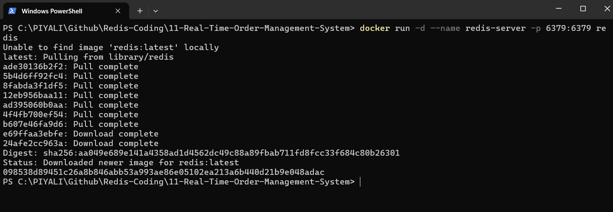
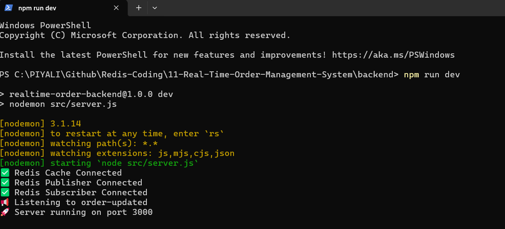
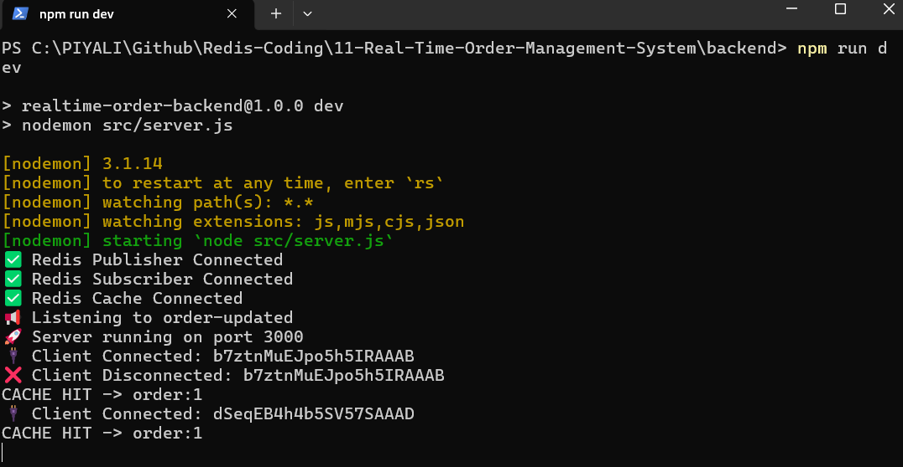
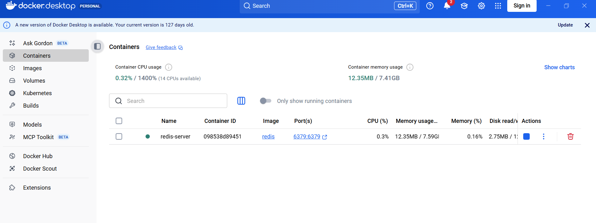
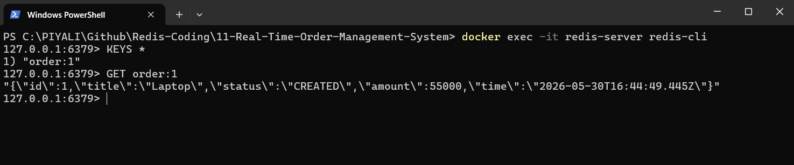

# 

The project uses Redis Pub/Sub for real-time communication and Redis Cache-Aside for API performance optimization. User data is first checked in Redis; on a cache miss it is loaded from the database and stored in Redis with a TTL. Cache invalidation is distributed through Redis Pub/Sub, and Redis uses the allkeys-lru eviction policy to automatically remove the least recently used entries when memory is full. This combines real-time scalability with efficient API caching.

> This is the kind of end-to-end architecture commonly used in systems such as Amazon order tracking, Uber ride status updates, Swiggy delivery tracking, and Flipkart real-time order management.

## Run Application

1. Run Redis using Docker
Open docker desktop. run cmd in root folder.
```
docker run -d --name redis-server -p 6379:6379 redis
```
Verify:
```
docker exec -it redis redis-cli ping
```
Expected:
```
PONG
```


2. Start Angular
```
cd frontend
npm install
npm start
```
Expected:
```
http://localhost:4200
```

3. Start backend
```
cd backend
npm install
```
Run in Development Mode
```
npm run dev
```
Run in Production Mode
```
npm start
```
Expected logs:
```
✅ Redis Cache Connected
✅ Redis Publisher Connected
✅ Redis Subscriber Connected

📢 Listening to order-updated

🚀 Server running on port 3000
```


4. Open browser:
```
http://localhost:4200
```
Click Load Order button. Check Backend log:     

First Click
```
CACHE MISS -> order:1
```
Second Click
```
CACHE HIT -> order:1
```
This confirms Redis caching is working.



5. Test Redis Cache


Run:
```
docker exec -it redis-server redis-cli
```
You should get:
```
127.0.0.1:6379>
```
Check Cached Keys. Inside Redis CLI:
```
KEYS *
```
Expected:
```
1) "order:1"
```
Read Cached Value
```
GET order:1
```
Expected:
```
"{\"id\":1,\"title\":\"Laptop\",\"status\":\"CREATED\",\"amount\":55000,\"time\":\"2026-05-30T16:44:49.445Z\"}"
```



6. Test Cache Invalidation

Use Postman or curl:
```
curl -X PUT http://localhost:3000/orders/1 \
-H "Content-Type: application/json" \
-d "{\"status\":\"PROCESSING\"}"
```

Backend logs:
```
Cache Invalidated: order:1
Published Order Updated Event: 1
Order Broadcasted
```
Angular UI updates instantly through Socket.IO.

6. Watch Redis in Real Time

Open another terminal:
```
redis-cli
```
Check keys:
```
KEYS *
```
Example:
```
order:1
```
View cache:
```
GET order:1
```
Example:
```
{
  "id":1,
  "title":"Laptop",
  "status":"CREATED"
}
```
After update:
```
KEYS *
```
The key will be deleted by cache invalidation and recreated on the next read.

## Complete Runtime Flow
```
Angular
   │
   │ GET /orders/1
   ▼
Node API
   │
   ▼
Redis Cache
   │
   ├── HIT
   │      ▼
   │   Return Data
   │
   └── MISS
          ▼
       Database
          ▼
      Save Cache
          ▼
       Return

Update Order
     │
     ▼
 Database Update
     │
     ▼
 DEL order:1
     │
     ▼
 Redis Pub/Sub
     │
     ▼
 Socket.IO
     │
     ▼
 Angular UI Auto Refresh
```

## Architecture
```
                    ┌─────────────────┐
                    │ Angular 19 UI   │
                    └────────┬────────┘
                             │
                       Socket.IO
                             │
                             ▼
                 ┌─────────────────────┐
                 │ Node.js API Server  │
                 │ + Socket.IO Server  │
                 └─────────┬───────────┘
                           │
                Cache Aside │
                           ▼
                   ┌─────────────┐
                   │ Redis Cache │
                   └──────┬──────┘
                          │
                 Pub/Sub  │
                          ▼
                 ┌──────────────┐
                 │ Redis PubSub │
                 └──────┬───────┘
                        │
                        ▼
               ┌─────────────────┐
               │ Order Publisher │
               └─────────────────┘
                        │
                        ▼
                 ┌────────────┐
                 │ PostgreSQL │
                 └────────────┘
```

## Folder Structure
```
realtime-order-system/

backend/
│
├── package.json
│
├── src/
│   │
│   ├── config/
│   │   └── redis.js
│   │
│   ├── controllers/
│   │   └── order.controller.js
│   │
│   ├── routes/
│   │   └── order.routes.js
│   │
│   ├── services/
│   │   ├── cache.service.js
│   │   ├── order.service.js
│   │   └── publisher.service.js
│   │
│   ├── socket/
│   │   └── socket.js
│   │
│   ├── subscribers/
│   │   └── order.subscriber.js
│   │
│   ├── db/
│   │   └── orders.js
│   │
│   └── server.js
│
└── node_modules/

frontend/

├── src/app/

│   ├── services/
│   │   ├── order.service.ts
│   │   └── socket.service.ts
│
│   ├── components/
│   │   └── order-dashboard/
│
│   └── app.component.ts
```

## End-to-End Flow with Features
1. Cache Aside Pattern

When Angular requests an order:
```
Angular
   │
   ▼
GET /orders/1
   │
   ▼
Redis GET order:1
   │
   ├── HIT
   │      │
   │      ▼
   │   Return Cache
   │
   └── MISS
          │
          ▼
      Database
          │
          ▼
      Redis SET order:1
          │
          ▼
       Return
```
2. Cache Invalidation

When an order changes:
```
PUT /orders/1
      │
      ▼
Update Database
      │
      ▼
DEL order:1
      │
      ▼
Publish Event
      │
      ▼
Redis Pub/Sub
      │
      ▼
Socket.IO
      │
      ▼
Angular UI
```

**Expected Logs**

First request:
```
CACHE MISS -> order:1
```
Second request:
```
CACHE HIT -> order:1
```
After update:
```
Cache Invalidated: order:1
Published Order Updated Event: 1
```
Next read after update:
```
CACHE MISS -> order:1
```
