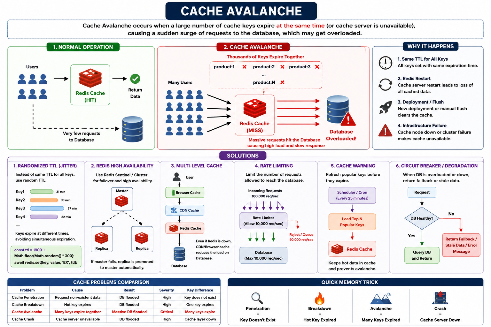

# Cache Avalanche
Cache Avalanche occurs when a large number of cache keys expire at the same time, causing a massive surge of requests to hit the database simultaneously.

This is more severe than Cache Breakdown because many keys expire together, not just one hot key.

> Cache Avalanche is a situation where a large number of cache entries expire simultaneously (or the cache layer becomes unavailable), causing a flood of requests to hit the database at once. Common mitigation strategies include randomized TTLs, Redis clustering/sentinel, cache warming, rate limiting, circuit breakers, and multi-level caching.

How caching raises issues? : https://www.youtube.com/shorts/Xpq0DGqGHyA



## Simplified Cache Avalanche Flow
```
                    NORMAL FLOW

            ┌───────────────┐
            │     Users     │
            └───────┬───────┘
                    │
                    ▼
            ┌───────────────┐
            │     Redis     │
            │  Cache HIT    │
            └───────┬───────┘
                    │
                    ▼
              Return Data

      Database receives very few requests


===================================================

                 CACHE AVALANCHE

      Thousands of Keys Expire Together

     product:1   ✖
     product:2   ✖
     product:3   ✖
     product:4   ✖
     ...
     product:N   ✖

                    │
                    ▼

            ┌───────────────┐
            │     Users     │
            └───────┬───────┘
                    │
      ┌─────────────┼─────────────┐
      ▼             ▼             ▼
   Request       Request       Request
      ▼             ▼             ▼

            ┌───────────────┐
            │     Redis     │
            │ Cache MISS    │
            └───────┬───────┘
                    │
      ┌─────────────┼─────────────┐
      ▼             ▼             ▼

            ┌───────────────┐
            │   Database    │
            │  Overloaded   │
            └───────────────┘
```

## Example Scenario

**Imagine Redis stores:**
```
product:1001   TTL = 30 min
product:1002   TTL = 30 min
product:1003   TTL = 30 min
product:1004   TTL = 30 min
...
product:100000 TTL = 30 min
```
At exactly 10:30 AM, all keys expire.

**Suddenly:**
```
Millions of Requests
        │
        ▼
      Redis
        │
        ▼
    Cache MISS
        │
        ▼
     Database
```
The database receives a huge spike in traffic and may become overloaded.

**Pictorial Diagram**
```
Normal Operation
Users
  │
  ▼
Redis Cache
  │
  ▼
Return Data

Database receives very few requests
```

**Avalanche Situation**
```
               All Keys Expired

         ┌─────────────────────┐
         │      Redis          │
         │ 100,000 Keys Gone   │
         └─────────┬───────────┘
                   │
             Cache MISS
                   │
        ┌──────────┼──────────┐
        ▼          ▼          ▼

      DB         DB         DB

         Database Overloaded
```

## Real-World Causes
1. Same TTL for All Keys

Bad practice:
```
await redis.set(key, value, 'EX', 1800);
```
Every key expires after exactly 30 minutes.

2. Redis Restart
```
Redis Server Restart
      │
      ▼
All Cached Data Lost
      │
      ▼
Database Traffic Explosion
```

3. Deployment Accident
```
Deploy New Version
      │
      ▼
Flush Redis
      │
      ▼
Millions of Cache Misses
```

4. Infrastructure Failure
```
Redis Node Down
      │
      ▼
Cache Layer Unavailable
      │
      ▼
DB Receives Everything
```

## Solution 1: Randomized TTL (Most Common)

Instead of:
```
Every Key = 30 min
```

**Use:**
```
Key1 = 30 + 1 min
Key2 = 30 + 3 min
Key3 = 30 + 7 min
Key4 = 30 + 2 min
```

**Diagram**
```
Without Jitter

30m ───────────────► Expire Together

With Jitter

31m ─► Key1
33m ─► Key2
37m ─► Key3
32m ─► Key4
```

**Code**
```
const ttl = 1800 + Math.floor(Math.random() * 300);

await redis.set(
  key,
  JSON.stringify(data),
  'EX',
  ttl
);
```
This spreads expirations over time.

## Prevention Architecture
```
                 Users
                    │
                    ▼
          ┌─────────────────┐
          │ Browser / CDN   │
          └────────┬────────┘
                   │
                   ▼
          ┌─────────────────┐
          │ Redis Cluster   │
          │ Random TTL      │
          │ Cache Warming   │
          └────────┬────────┘
                   │
                   ▼
          ┌─────────────────┐
          │ Rate Limiter    │
          │ Circuit Breaker │
          └────────┬────────┘
                   │
                   ▼
          ┌─────────────────┐
          │    Database     │
          └─────────────────┘
```

## Solution 2: Redis High Availability

Use:
```
Redis Sentinel
```
or
```
Redis Cluster
```

**Architecture**
```
           Master
              │
      ┌───────┴───────┐
      ▼               ▼
   Replica1       Replica2
```

If the master fails:
```
Replica promoted automatically
```
This reduces the chance of total cache loss.

## Solution 3: Multi-Level Cache

**Use:**
```
Browser Cache
       │
       ▼
CDN Cache
       │
       ▼
Redis Cache
       │
       ▼
Database
```

**Diagram**
```
User
 │
 ▼
Browser Cache
 │ Miss
 ▼
CDN
 │ Miss
 ▼
Redis
 │ Miss
 ▼
Database
```
Even if Redis fails, CDN/browser caches absorb part of the traffic.

## Solution 4: Rate Limiting

**Protect the database.**
```
Database Capacity = 10,000 req/sec

Incoming = 100,000 req/sec

Allow = 10,000
Reject = 90,000
```

**Example technologies:**
- Redis Rate Limiter
- Token Bucket
- Leaky Bucket

## Solution 5: Cache Warming

**Before keys expire:**
```
Scheduler
   │
   ▼
Refresh Popular Keys
   │
   ▼
Redis
```

**Example:**
```
Every 25 minutes
Refresh Top Products
```

## Solution 6: Circuit Breaker / Degradation

When DB is overloaded:
```
Show Cached/Stale Data
```
or
```
Show:
"Service temporarily busy"
```
instead of crashing.

**Flow**
```
Request
   │
   ▼
DB Healthy?
   │
 ┌─┴──┐
 │Yes │
 └─┬──┘
   ▼
 Query DB

Else
   ▼
 Return Fallback
```

## Avalanche vs Breakdown
| Feature       | Cache Breakdown | Cache Avalanche |
| ------------- | --------------- | --------------- |
| Expired Keys  | One hot key     | Many keys       |
| Traffic Spike | Large           | Massive         |
| DB Impact     | High            | Very High       |
| Common Fix    | Mutex Lock      | Random TTL      |
| Severity      | Medium-High     | Critical        |

## Visualization
```
Cache Breakdown

Hot Key Expired
      │
      ▼
100,000 Requests
      │
      ▼
Database


Cache Avalanche

100,000 Keys Expired
      │
      ▼
Millions of Requests
      │
      ▼
Database
```