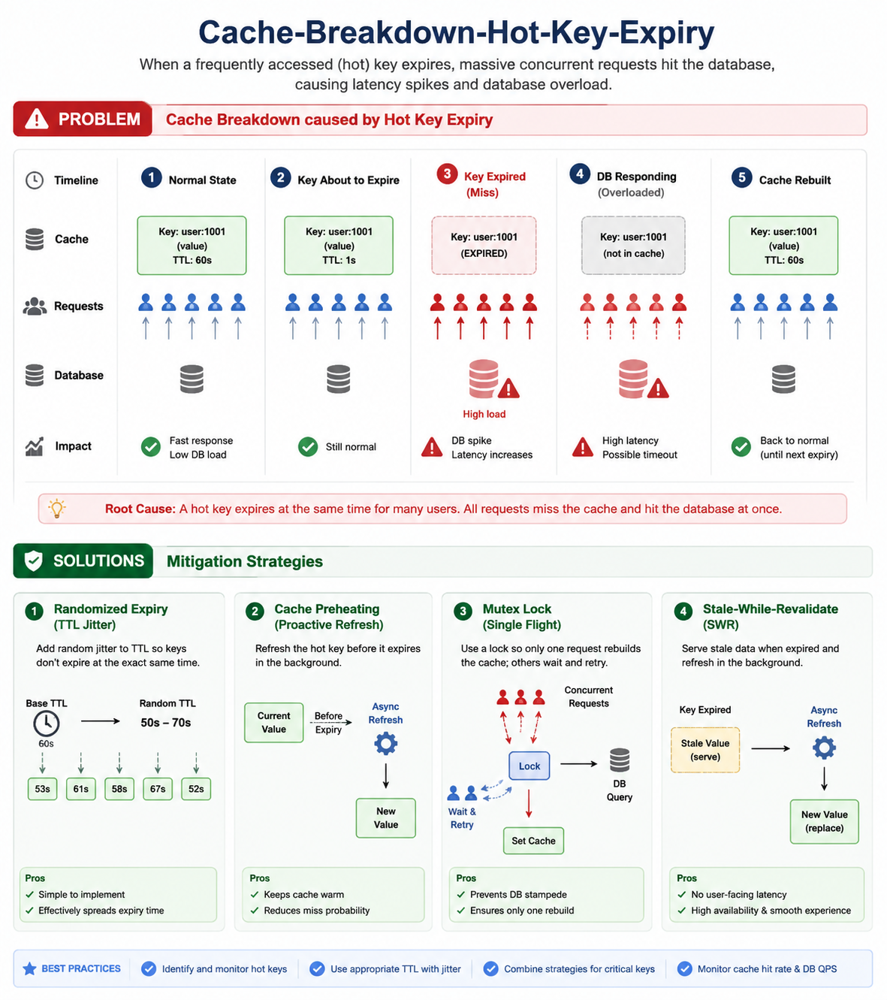

# Cache Breakdown / Hot Key Expiry
Cache Breakdown (also called Hot Key Expiry) occurs when a very popular cache key expires, and suddenly thousands or millions of requests hit the database simultaneously to rebuild that cache entry.

Unlike Cache Penetration (requesting non-existent data), the data actually exists in the database.



## Example Scenario

Suppose an e-commerce site caches:
```
product:1001
```

This is the most viewed product.
```
Redis
┌─────────────────────┐
│ product:1001        │
│ TTL = 30 minutes    │
└─────────────────────┘
```

At 10:00 AM:
```
TTL expires
```

Suddenly:
```
100,000 users
        │
        ▼
Redis MISS
        │
        ▼
Database
```
All requests go directly to the database.

## Pictorial Diagram
```
                Before Expiry

         ┌─────────────────┐
         │      Redis      │
         │ product:1001    │
         └────────┬────────┘
                  │ HIT
                  ▼
             Return Data

Users ─────────────────────────► Redis


===================================================

                 After Expiry

      100,000 Requests Arrive Together

                    Users
         ┌─────┬─────┬─────┬─────┐
         ▼     ▼     ▼     ▼     ▼

                Redis
                  │
             Cache MISS
                  │
      ┌───────────┼───────────┐
      ▼           ▼           ▼
     DB          DB          DB
      ▼           ▼           ▼

      Database Overloaded
```

Why It Happens

Common reasons:
- Hot key expires.
- Cache server restart.
- Deployment clears cache.
- Large TTL batch expiration.
- Flash sale / viral product.

## Solution 1: Mutex Lock (Most Common)

Only one request rebuilds cache.

Others wait.
```
Request 1
    │
    ▼
Acquire Lock
    │
    ▼
Query DB
    │
    ▼
Update Cache
    │
    ▼
Release Lock

--------------------------------

Request 2..100000
    │
    ▼
Lock Exists
    │
    ▼
Wait / Retry
```

**Flow**
```
Cache Miss
    │
    ▼
Try Lock
    │
 ┌──┴───┐
 │Success│
 └──┬───┘
    ▼
 Fetch DB
    ▼
 Update Cache
    ▼
 Release Lock

Else
    ▼
 Wait
    ▼
 Retry Cache
```

**Redis Example**
```
const lock = await redis.set(
  'lock:product:1001',
  '1',
  'NX',
  'EX',
  5
);

if (lock) {
   const data = await db.getProduct(1001);

   await redis.set(
      'product:1001',
      JSON.stringify(data),
      'EX',
      1800
   );

   await redis.del('lock:product:1001');
}
```

## Solution 2: Never Expire Hot Keys

Keep hot data permanently in cache.
```
Redis
┌────────────────────┐
│ product:1001       │
│ No TTL             │
└────────────────────┘
```
Update cache asynchronously when DB changes.

Good for:
- Product catalog
- Configuration
- User roles
- Country lists

## Solution 3: Logical Expiration

Store expiration time inside data.
```
{
  "data": {...},
  "expireTime": "2026-05-31T12:00:00"
}
```

**When expired:**
```
User Request
      │
      ▼
Return Old Data Immediately
      │
      ▼
Background Thread Refreshes Cache
```

**Diagram**
```
           Cache Expired

User
 │
 ▼
Redis
 │
 ▼
Return Stale Data
 │
 ▼
Background Worker
 │
 ▼
Database
 │
 ▼
Refresh Cache
```

Advantage:
- No request waits.
- No DB storm.

## Solution 4: Randomized TTL (Jitter)

Avoid many keys expiring at the same moment.
```
Bad:

Key1 → 30 min
Key2 → 30 min
Key3 → 30 min
```
All expire together.

**Better:**
```
Key1 → 30 min + 3 min
Key2 → 30 min + 7 min
Key3 → 30 min + 1 min
```

**Example:**
```
const ttl = 1800 + Math.floor(Math.random() * 300);

await redis.set(
  key,
  JSON.stringify(data),
  'EX',
  ttl
);
```

## Solution 5: Cache Warming (Preloading)

Before expiry:
```
Scheduler
    │
    ▼
Refresh Hot Keys
    │
    ▼
Redis
```

Example:
```
Every 25 minutes
      │
      ▼
Reload top 100 products
```

## Comparison
| Technique          | Prevents DB Storm | Complexity |
| ------------------ | ----------------- | ---------- |
| Mutex Lock         | ✅ Excellent       | Medium     |
| Logical Expiration | ✅ Excellent       | High       |
| No Expiry          | ✅ Excellent       | Low        |
| Random TTL         | ✅ Good            | Low        |
| Cache Warming      | ✅ Good            | Medium     |

## Difference Between Cache Problems
| Problem           | Cause                     | Result     |
| ----------------- | ------------------------- | ---------- |
| Cache Penetration | Request non-existent data | DB flooded |
| Cache Breakdown   | Hot key expires           | DB flooded |
| Cache Avalanche   | Many keys expire together | DB flooded |
| Cache Crash       | Redis unavailable         | DB flooded |

## Quick Memory Trick
```
Penetration = Key Doesn't Exist

Breakdown = Hot Key Expired

Avalanche = Many Keys Expired

Crash = Cache Server Down
```

For high-traffic systems (Amazon, Flipkart, Swiggy, Zomato), the most common mitigation for hot-key expiry is a combination of Redis mutex locks + randomized TTL + cache warming, which prevents a single hot key from causing a database stampede.