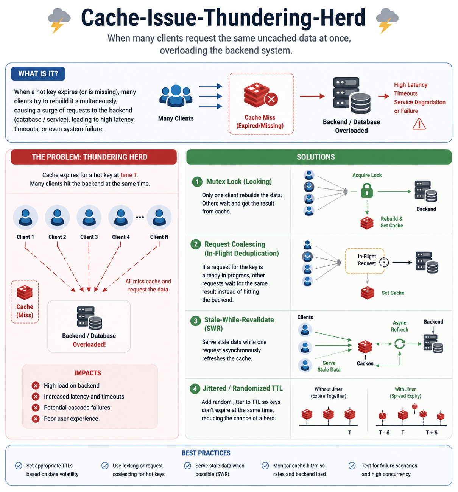

# Thundering Herd

A Thundering Herd problem in caching happens when a popular cache entry expires (or is missing), and many requests simultaneously hit the backend database to regenerate the same data.

This can overload the database and cause outages.



## Example

Suppose:
- Cache key: product:123
- Cache TTL: 10 minutes
- 100,000 users visit the product page every minute

**Normal Flow**
```
Users
  ↓
Redis Cache
  ↓ (cache hit)
Response
```
Everything is fast.

**When Cache Expires**

At exactly 10:00 AM:
```
Cache Entry Expires
       ↓
1000 requests arrive simultaneously
       ↓
All see Cache MISS
       ↓
All query Database
       ↓
Database overloaded
       ↓
High latency / Crash
```

```
           Cache MISS
                 │
 ┌───────────────┼───────────────┐
 │               │               │
Req1          Req2           Req3
 │               │               │
 ▼               ▼               ▼
 DB            DB             DB
 │               │               │
 └───────────────┼───────────────┘
                 ▼
          Database Overload
```
This sudden flood of requests is called the Thundering Herd.

## Real Startup Failure Scenario

**A startup used Cache-Aside:**
```
Application
    ↓
Redis
    ↓ (miss)
Database
```

**An attacker repeatedly requested:**
```
user:999999999999
```
which did not exist.

**Every request became:**
```
Redis MISS
   ↓
Database Query
   ↓
No Record Found
```

**Thousands of such requests:**
```
100k Requests
      ↓
100k DB Queries
      ↓
DB CPU 100%
      ↓
Outage
```

**This is often called:**
- Cache Penetration
- Cache Stampede
- Thundering Herd

depending on the exact behavior.

## Solutions

### 1. Cache Locking (Single Flight)

Only one request rebuilds the cache.
```
Req1 → Cache MISS
      → Acquire Lock
      → Query DB
      → Update Cache

Req2 → Wait

Req3 → Wait

Req4 → Wait
```
```
         Cache MISS
               │
       Acquire Lock
               │
               ▼
             Req1
               │
               ▼
              DB
               │
         Update Cache
               │
      Release Lock
               │
      ┌────────┼────────┐
      ▼        ▼        ▼
    Req2     Req3     Req4
      Cache HIT
```

**Redis Lock Example**
```
const lock = await redis.set(
  "lock:product:123",
  "1",
  "NX",
  "EX",
  5
);

if (lock) {
   // fetch from DB
}
```

### 2. Cache Null Values

Prevent cache penetration.
```
if (!data) {
   await redis.set(
      key,
      "NULL",
      "EX",
      60
   );
}
```

Now:
```
Request
   ↓
Redis → NULL
   ↓
Return Not Found
```
Database is protected.

### 3. Randomized TTL (Jitter)

Bad:
```
1000 keys expire at 10:00
```

Good:
```
Key1 → 600 sec
Key2 → 615 sec
Key3 → 632 sec
Key4 → 590 sec
```
```
const ttl = 600 + Math.floor(Math.random() * 60);
```
This prevents mass expiration at the same instant.

### 4. Stale-While-Revalidate

Serve old data while refreshing in background.
```
Cache Expired
      ↓
Return Old Value
      ↓
Background Refresh
      ↓
Update Cache
```
```
User
  │
  ▼
Old Cache Data
  │
  └──► Background Worker
              │
              ▼
             DB
              │
              ▼
          Refresh Cache
```
Users experience no latency spike.

### 5. Bloom Filter

For invalid keys:
```
Request user:99999999
      ↓
Bloom Filter
      ↓
Definitely Not Present
      ↓
Reject Request
```
```
           Request
               │
               ▼
        Bloom Filter
               │
      ┌────────┴────────┐
      ▼                 ▼
 Not Possible      Might Exist
      │                 │
   Reject          Check Cache
```
This blocks many cache penetration attacks before they reach Redis or the database.

## Cache Issues Comparison
| Problem                          | Cause                                             | Effect             | Solution                    |
| -------------------------------- | ------------------------------------------------- | ------------------ | --------------------------- |
| Cache Penetration                | Non-existent keys                                 | DB flooded         | Null caching, Bloom filter  |
| Cache Breakdown / Hot Key Expiry | One popular key expires                           | DB spike           | Locking, SWR                |
| Thundering Herd                  | Many requests regenerate same data simultaneously | DB overload        | Locking, request coalescing |
| Cache Avalanche                  | Many keys expire together                         | Massive DB traffic | Random TTL, prewarming      |

## Complete Architecture
```
                Users
                  │
                  ▼
            Load Balancer
                  │
                  ▼
             Application
                  │
                  ▼
           Bloom Filter
                  │
          ┌───────┴────────┐
          ▼                ▼
     Not Exist        Redis Cache
          │                │
      Reject        HIT → Return
                           │
                        MISS
                           │
                     Redis Lock
                           │
                 ┌─────────┴─────────┐
                 ▼                   ▼
            Lock Owner         Other Requests
                 │                   │
                 ▼                   │
             Database               Wait
                 │                   │
                 ▼                   │
             Update Cache ◄──────────┘
                 │
                 ▼
              Response
```
**This combination (Bloom Filter + Redis Lock + Null Cache + TTL Jitter + Stale-While-Revalidate) is what large-scale systems such as Netflix, Amazon, and Uber commonly use to protect databases from thundering herd and cache stampede issues at scale.**