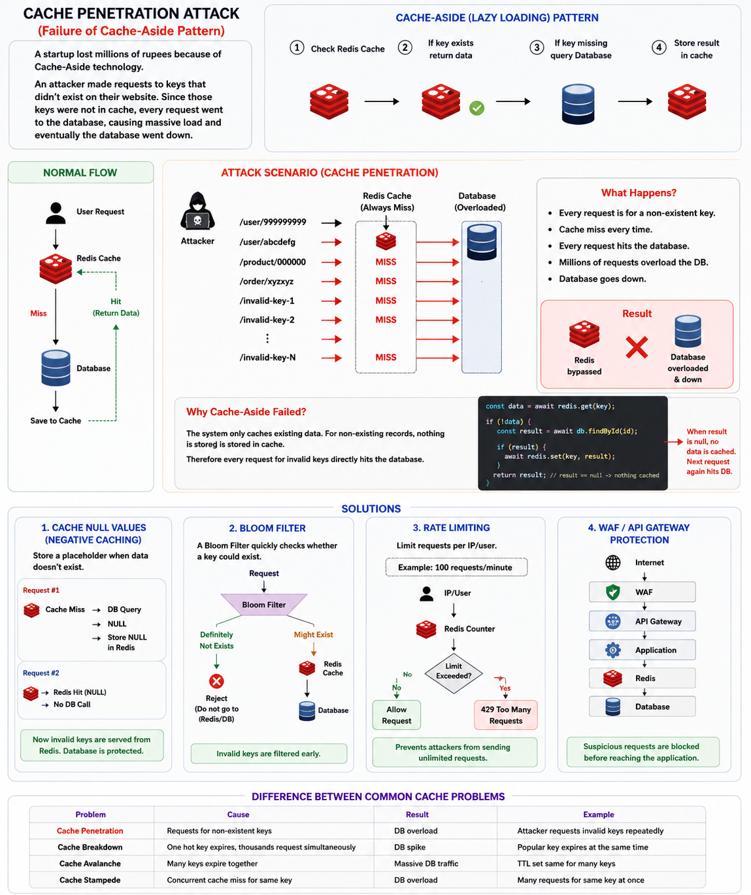

# Cache Penetration Attack
 > A statup company lost of millians of rupess because they used cache-aside technology. One attacker made a request to a key on their website which didn't exit. Due to this, all requests are went to DB and their DB went down.
 > How caching raises issues? : https://www.youtube.com/shorts/Xpq0DGqGHyA

**For the startup example you described, the root cause is Cache Penetration: attackers repeatedly requested keys that never existed, causing every request to bypass Redis and hit the database until the database became overloaded and unavailable.**

Yes, this is a well-known failure mode of the Cache-Aside (Lazy Loading) pattern called a Cache Penetration Attack (sometimes called cache bypass).



## What happened?

Imagine the application uses:
```
1. Check Redis Cache
2. If key exists → return data
3. If key missing → query Database
4. Store result in cache
```

## Normal Flow
```
User Request
      │
      ▼
   Redis Cache
      │
      ├── Hit → Return Data
      │
      └── Miss
             │
             ▼
         Database
             │
             ▼
         Save to Cache
```

## Attack Scenario

**Suppose the attacker requests:**
```
/user/999999999
```
and this user does not exist.

**Request 1**
```
Cache Miss
      ↓
DB Query
      ↓
No Record Found
```
Since there is no data, nothing is cached.

**Request 2**
```
Cache Miss
      ↓
DB Query
      ↓
No Record Found
```
Again Redis has nothing.

**Request 3, 4, 5, 100000...**

**Every request:**
```
Redis Miss
      ↓
Database Hit
      ↓
No Record
```
Millions of requests can directly hammer the database.
```
Attacker
    │
    ├── invalid-key-1 ──► DB
    ├── invalid-key-2 ──► DB
    ├── invalid-key-3 ──► DB
    ├── invalid-key-4 ──► DB
    └── invalid-key-N ──► DB

Result:
Redis = bypassed
Database = overloaded
```

## Why Cache-Aside Failed?

Because the system cached only existing data.

**For non-existing records:**
```
const data = await redis.get(key);

if (!data) {
   const result = await db.findById(id);

   if (result) {
      await redis.set(key, result);
   }

   return result;
}
```
When result == null, nothing is stored in Redis.

Therefore every request hits the database.

## Solution 1: Cache Null Values (Negative Caching)

**Store a placeholder when data doesn't exist.**
```
if (!result) {
   await redis.set(
      key,
      "NULL",
      "EX",
      60
   );
   return null;
}
```

**Now:**
```
Request #1
   Cache Miss
      ↓
   DB Query
      ↓
   NULL
      ↓
Store NULL in Redis

Request #2
      ↓
Redis Hit (NULL)
      ↓
No DB Call
```

**Architecture:**
```
             Redis
          ┌─────────┐
          │  NULL   │
          └─────────┘
                ▲
                │
Attacker ───────┘
```
Database untouched

## Solution 2: Bloom Filter

A Bloom Filter quickly checks whether a key could exist.
```
Request
   │
   ▼
Bloom Filter
   │
   ├── Definitely Not Exists
   │          ↓
   │      Reject
   │
   └── Might Exist
             ↓
          Redis
             ↓
          Database
```
**Example:**
```
user:1     ✓
user:2     ✓
user:3     ✓

user:999999999 ✗
```
The request never reaches Redis or DB.

This is commonly used by:
- Alibaba
- Tencent
- Large-scale internet platforms

for preventing cache penetration.

## Solution 3: Rate Limiting

Limit requests per IP/user.
```
100 requests/minute
```
Using Redis:
```
IP → Counter
```
If exceeded:
``
429 Too Many Requests
```

## Solution 4: WAF / API Gateway Protection
```
Internet
    │
    ▼
WAF
    │
    ▼
API Gateway
    │
    ▼
Application
    │
    ▼
Redis
    │
    ▼
Database
```
Suspicious requests are blocked before reaching the application.


## Difference Between Common Cache Problems
| Problem           | Cause                                                    | Result             |
| ----------------- | -------------------------------------------------------- | ------------------ |
| Cache Penetration | Requests for non-existent keys                           | DB overload        |
| Cache Breakdown   | One hot key expires and thousands request simultaneously | DB spike           |
| Cache Avalanche   | Many keys expire together                                | Massive DB traffic |
| Cache Stampede    | Concurrent cache miss for same key                       | DB overload        |
