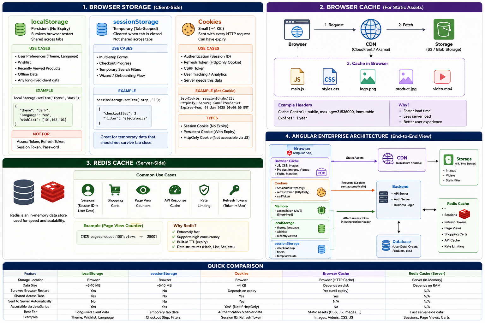

# Real Enterprise Architecture


```
┌───────────────────────────────────────────────────────────┐
│                       USER BROWSER                        │
└───────────────────────────────────────────────────────────┘
                           │
                           │
                           ▼

┌───────────────────────────────────────────────────────────┐
│                    BROWSER STORAGE                        │
├───────────────────────────────────────────────────────────┤
│ Cookies                                                   │
│  • Session ID                                             │
│  • Refresh Token (HttpOnly)                               │
│  • CSRF Token                                              │
│                                                           │
│ LocalStorage                                              │
│  • Theme                                                  │
│  • Language                                               │
│  • Wishlist                                               │
│  • Recently Viewed Products                               │
│                                                           │
│ SessionStorage                                            │
│  • Checkout Step                                          │
│  • Search Filters                                         │
│  • Multi-step Form Data                                   │
│                                                           │
│ Memory (Angular Service / State)                          │
│  • Access Token                                           │
│  • User Context                                           │
│  • Current Session Data                                   │
└───────────────────────────────────────────────────────────┘
                           │
                           │
                           ▼

┌───────────────────────────────────────────────────────────┐
│                     BROWSER CACHE                         │
├───────────────────────────────────────────────────────────┤
│ main.js                                                   │
│ styles.css                                                │
│ vendor.js                                                 │
│ fonts                                                     │
│ product images                                            │
│ videos                                                    │
└───────────────────────────────────────────────────────────┘
                           │
                           │
                           ▼

┌───────────────────────────────────────────────────────────┐
│                      CDN / EDGE                           │
├───────────────────────────────────────────────────────────┤
│ CloudFront / Akamai / Cloudflare                          │
│                                                           │
│ Cached Assets                                             │
│  • Product Images                                         │
│  • Videos                                                 │
│  • JS Bundles                                             │
│  • CSS Files                                              │
└───────────────────────────────────────────────────────────┘
                           │
                           │
                           ▼

┌───────────────────────────────────────────────────────────┐
│               API GATEWAY / LOAD BALANCER                │
└───────────────────────────────────────────────────────────┘
                           │
          ┌────────────────┼────────────────┐
          │                │                │
          ▼                ▼                ▼

┌──────────────┐  ┌──────────────┐  ┌──────────────┐
│ Auth Service │  │ Order Service│  │Product Service│
└──────┬───────┘  └──────┬───────┘  └──────┬───────┘
       │                 │                 │
       └─────────────────┼─────────────────┘
                         │
                         ▼

┌───────────────────────────────────────────────────────────┐
│                         REDIS                             │
├───────────────────────────────────────────────────────────┤
│ Authentication                                            │
│  • Session Store                                          │
│  • Refresh Tokens                                         │
│                                                           │
│ Application Cache                                         │
│  • Product Details                                        │
│  • User Profiles                                          │
│  • API Responses                                          │
│                                                           │
│ Real-Time                                                 │
│  • Pub/Sub                                                │
│  • Socket.IO Events                                       │
│                                                           │
│ Analytics                                                 │
│  • Page View Counters                                     │
│  • Trending Products                                      │
│                                                           │
│ Performance                                               │
│  • Rate Limiting                                          │
│  • Distributed Locks                                      │
│  • Job Queues                                              │
└───────────────────────────────────────────────────────────┘
                         │
                         ▼

┌───────────────────────────────────────────────────────────┐
│                    PRIMARY DATABASE                       │
├───────────────────────────────────────────────────────────┤
│ Users                                                     │
│ Orders                                                    │
│ Products                                                  │
│ Payments                                                  │
│ Inventory                                                 │
└───────────────────────────────────────────────────────────┘

                         │
                         ▼

┌───────────────────────────────────────────────────────────┐
│                  OBJECT STORAGE (S3)                      │
├───────────────────────────────────────────────────────────┤
│ Product Images                                            │
│ User Uploads                                              │
│ Videos                                                    │
│ Documents                                                 │
└───────────────────────────────────────────────────────────┘
```

**Where each data should live**
| Data            | Browser Memory | SessionStorage | LocalStorage | Cookie   | Redis    | DB       | CDN |
| --------------- | -------------- | -------------- | ------------ | -------- | -------- | -------- | --- |
| Access Token    | ✅              | ⚠️             | ❌            | ⚠️       | ❌        | ❌        | ❌   |
| Refresh Token   | ❌              | ❌              | ❌            | ✅        | ✅        | ✅        | ❌   |
| Session ID      | ❌              | ❌              | ❌            | ✅        | ✅        | ❌        | ❌   |
| Theme           | ❌              | ❌              | ✅            | ❌        | ❌        | ❌        | ❌   |
| Language        | ❌              | ❌              | ✅            | Optional | ❌        | ❌        | ❌   |
| Checkout Step   | ❌              | ✅              | ❌            | ❌        | ❌        | ❌        | ❌   |
| Wishlist        | ❌              | ❌              | ✅            | ❌        | Optional | ✅        | ❌   |
| Shopping Cart   | ❌              | ❌              | Optional     | ❌        | ✅        | ✅        | ❌   |
| Product Details | ❌              | ❌              | ❌            | ❌        | ✅        | ✅        | ❌   |
| Page Views      | ❌              | ❌              | ❌            | ❌        | ✅        | Optional | ❌   |
| Static JS/CSS   | ❌              | ❌              | ❌            | ❌        | ❌        | ❌        | ✅   |
| Product Images  | ❌              | ❌              | ❌            | ❌        | ❌        | S3       | ✅   |
| Videos          | ❌              | ❌              | ❌            | ❌        | ❌        | S3       | ✅   |

# Angular + Redis + E-commerce Interview Summary
```
Access Token      → Memory
Refresh Token     → HttpOnly Cookie + Redis
Session ID        → Cookie + Redis
Theme             → LocalStorage
Checkout State    → SessionStorage
Shopping Cart     → Redis + DB
Page Views        → Redis Counter
Product Data      → Redis Cache + DB
Images/Videos     → S3 + CDN + Browser Cache
Static Files      → CDN + Browser Cache
```

# Browser Storage, Browser Cache & Redis Cache — Architecture Diagram
```
┌───────────────────────────────────────────────────────────────┐
│                         USER BROWSER                          │
└───────────────────────────────────────────────────────────────┘

 ┌─────────────────┐   ┌─────────────────┐   ┌─────────────────┐
 │  localStorage   │   │ sessionStorage  │   │     Cookies     │
 ├─────────────────┤   ├─────────────────┤   ├─────────────────┤
 │ Theme           │   │ Checkout Step   │   │ Session ID      │
 │ Language        │   │ Form Wizard     │   │ Refresh Token   │
 │ Wishlist        │   │ Search Filters  │   │ CSRF Token      │
 │ Recent Products │   │ Temp UI State   │   │ User Preference │
 └─────────────────┘   └─────────────────┘   └─────────────────┘
          │                      │                     │
          │                      │                     │
          └──────────────┬───────┘                     │
                         │                             │
                         ▼                             ▼
               ┌───────────────────┐       ┌───────────────────┐
               │ Angular / React   │       │ Sent Automatically│
               │ Application       │       │ With Every Request│
               └───────────────────┘       └───────────────────┘
                         │                             │
                         └──────────────┬──────────────┘
                                        │
                                        ▼
┌───────────────────────────────────────────────────────────────┐
│                      Browser Memory                           │
├───────────────────────────────────────────────────────────────┤
│ Access Token (JWT)                                            │
│ User Context                                                  │
│ Runtime Application State                                     │
└───────────────────────────────────────────────────────────────┘


═══════════════════════════════════════════════════════════════════

                 STATIC ASSET CACHING FLOW

┌──────────┐
│ Browser  │
└────┬─────┘
     │
     ▼
┌─────────────────────────────────────┐
│         Browser Cache               │
├─────────────────────────────────────┤
│ main.js                             │
│ styles.css                          │
│ logo.png                            │
│ product-image.jpg                   │
│ intro-video.mp4                     │
│ fonts                               │
└─────────────────────────────────────┘
     ▲
     │ Cache-Control:max-age
     │
┌────┴─────┐
│   CDN    │
└────┬─────┘
     │
     ▼
┌──────────┐
│ S3/Blob  │
│ Storage  │
└──────────┘


═══════════════════════════════════════════════════════════════════

                 AUTHENTICATION FLOW

┌──────────┐
│ Browser  │
└────┬─────┘
     │
     │ Cookie(SessionId / RefreshToken)
     ▼
┌──────────┐
│ Backend  │
└────┬─────┘
     │
     ▼
┌──────────────────────┐
│        Redis         │
├──────────────────────┤
│ Session Data         │
│ Refresh Tokens       │
│ User State           │
└──────────────────────┘


═══════════════════════════════════════════════════════════════════

                 PAGE VIEW COUNT FLOW

 User Opens Product Page
            │
            ▼
      ┌──────────┐
      │ Backend  │
      └────┬─────┘
           │
           ▼
      ┌──────────┐
      │  Redis   │
      ├──────────┤
      │ INCR     │
      │ product  │
      │ views    │
      └──────────┘


═══════════════════════════════════════════════════════════════════

                 E-COMMERCE APPLICATION

                        USER
                          │
                          ▼

┌───────────────────────────────────────────────────────────────┐
│                         BROWSER                               │
├───────────────────────────────────────────────────────────────┤
│ localStorage                                                  │
│   ├─ Theme                                                    │
│   ├─ Wishlist                                                 │
│   └─ Language                                                 │
│                                                               │
│ sessionStorage                                                │
│   ├─ Checkout Step                                            │
│   └─ Search Filters                                           │
│                                                               │
│ Cookies                                                       │
│   ├─ Session ID                                               │
│   └─ Refresh Token                                            │
│                                                               │
│ Memory                                                        │
│   └─ Access Token                                             │
│                                                               │
│ Browser Cache                                                 │
│   ├─ JS Bundles                                               │
│   ├─ CSS                                                      │
│   ├─ Product Images                                           │
│   └─ Videos                                                   │
└───────────────────────────────────────────────────────────────┘
                          │
                          ▼
┌───────────────────────────────────────────────────────────────┐
│                         BACKEND                               │
└───────────────────────────────────────────────────────────────┘
                          │
          ┌───────────────┴────────────────┐
          ▼                                ▼

┌──────────────────┐            ┌──────────────────┐
│      Redis       │            │     Database     │
├──────────────────┤            ├──────────────────┤
│ Sessions         │            │ Users            │
│ Refresh Tokens   │            │ Orders           │
│ Shopping Cart    │            │ Products         │
│ API Cache        │            │ Payments         │
│ Page Views       │            │ Inventory        │
│ Rate Limiting    │            │ Analytics        │
└──────────────────┘            └──────────────────┘

                          │
                          ▼

                   ┌─────────────┐
                   │ CDN + S3    │
                   ├─────────────┤
                   │ Images      │
                   │ Videos      │
                   │ Documents   │
                   └─────────────┘
```

# Interview Summary
```
localStorage   → Persistent client data (theme, wishlist)
sessionStorage → Temporary tab data (checkout, filters)
Cookies        → Authentication (session, refresh token)
Memory         → Access token (JWT)
Browser Cache  → JS, CSS, Images, Videos
Redis          → Sessions, API cache, carts, page views
CDN            → Product images & videos
```

# localStorage, sessionStorage, and cookies
| Feature                      | localStorage     | sessionStorage     | Cookies                       |
| ---------------------------- | ---------------- | ------------------ | ----------------------------- |
| Storage Size                 | ~5-10 MB         | ~5-10 MB           | ~4 KB                         |
| Sent to Server Automatically | ❌ No             | ❌ No               | ✅ Yes                         |
| Survives Browser Restart     | ✅ Yes            | ❌ No               | Depends on expiry             |
| Shared Across Tabs           | ✅ Yes            | ❌ No               |                               |
| Accessible via JS            | ✅ Yes            | ✅ Yes              | Usually Yes (unless HttpOnly) |
| Best For                     | User preferences | Temporary tab data | Authentication                |


