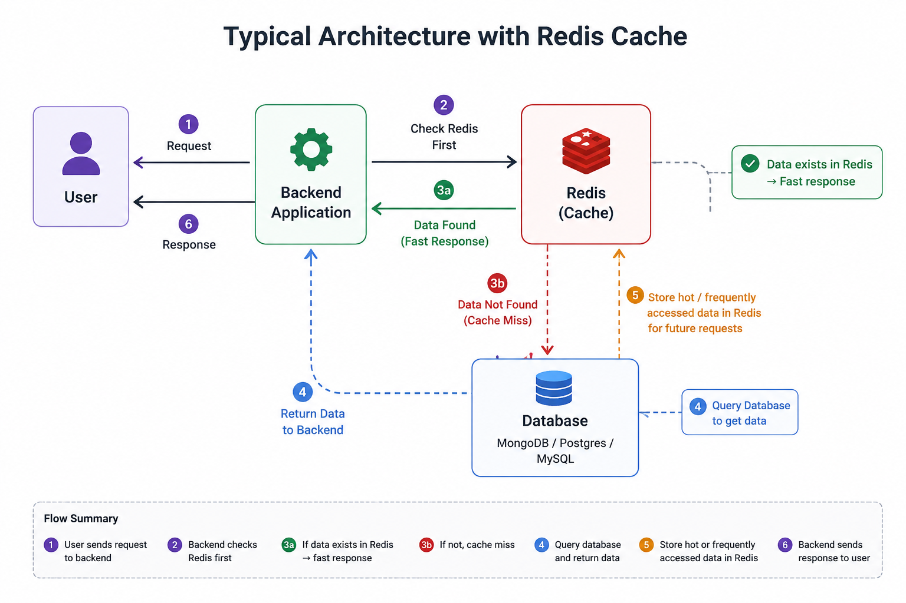

# Redis-Coding

Nowadays database boundaries are getting blurred. Even PostgreSQL can be used somewhat like Redis. So some of the things I’ll say are opinions — standard opinions — but they can be challenged because databases evolve very fast these days.

Let’s understand Redis with an analogy.

Nowadays database boundaries are getting blurred. Even PostgreSQL can be used somewhat like Redis. So some of the things I’ll say are opinions — standard opinions — but they can be challenged because databases evolve very fast these days.

**Let’s understand Redis with an analogy.**

Suppose there’s a grocery shop. A customer asks:
```
“What’s the price of tea?”
```
The shopkeeper doesn’t remember, so he goes to the back store, opens a register, searches for the tea price, comes back, and tells the customer.

Another customer comes later and asks the same question. Again, the shopkeeper forgets, goes back, checks the register, and returns with the answer.

Now multiply that by 10,000 users. The shopkeeper can’t keep checking the register every time.

So what does he do?
```
He puts up a board in front:
“Tea price = ₹20”
```
Now whenever someone asks, he simply points at the board.

That board is basically Redis.

**Redis is not just about making things faster, but this is the simplest summary:**
- Frequently requested data is kept ready in memory
- Access becomes very fast

That’s why Redis is often called an in-memory database/store.

**Technically, “in-memory” means data is stored in RAM, which is much faster than reading from disk. Redis mainly serves data from memory, which makes it lightning fast.**

**Some people argue Redis is not purely in-memory because it also supports persistence — meaning after restart it can reload data from files back into memory. That’s true.**

**Some people call Redis:**
- an in-memory store
- a hash map store
- a database

All are acceptable depending on context.

**Then the speaker explains the typical architecture:**
```
User → Backend Application
Backend checks Redis first
If data exists in Redis → fast response
If not → query database (MongoDB/Postgres/MySQL)
Then store hot/frequently accessed data into Redis for future requests
```


**Important point:** Redis is NOT a replacement for the database.

The database remains the “source of truth.”

**Redis mainly reduces:**
- read pressure
- repeated expensive queries

The speaker then explains common Redis use cases:


