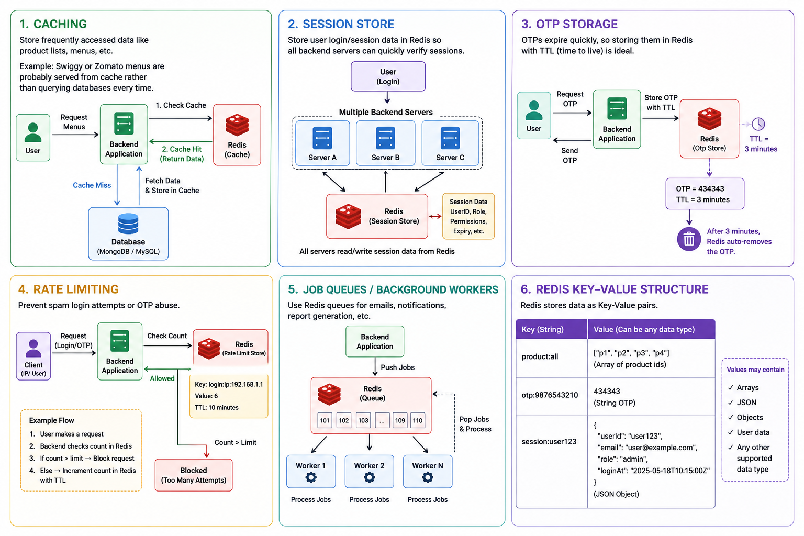

# Redis
Redis is a high-speed, general-purpose in-memory database and cache.

Nowadays database boundaries are getting blurred. Even PostgreSQL can be used somewhat like Redis. So some of the things I’ll say are opinions — standard opinions — but they can be challenged because databases evolve very fast these days.

```
Redis       → cache/session/OTP
BullMQ      → background jobs
RabbitMQ    → enterprise messaging
Kafka       → event streaming + analytics
```

## Tutorials
1. What is Redis and why it exists : https://www.youtube.com/watch?v=5YqP18Gyop0
2. Complete local setup to learn Redis : https://www.youtube.com/watch?v=UEm0mHeXdxk

## Redis
Let’s understand Redis with an analogy.

Nowadays database boundaries are getting blurred. Even PostgreSQL can be used somewhat like Redis. So some of the things I’ll say are opinions — standard opinions — but they can be challenged because databases evolve very fast these days.

**Let’s understand Redis with an analogy.**

Suppose there’s a grocery shop. A customer asks:
```
“What’s the price of tea?”
```
The shopkeeper doesn’t remember, so he goes to the back store, opens a register, searches for the tea price, comes back, and tells the customer.

Another customer comes later and asks the same question. Again, the shopkeeper forgets, goes back, checks the register, and returns with the answer.

Now multiply that by 10,000 users. The shopkeeper can’t keep checking the register every time.

So what does he do?
```
He puts up a board in front:
“Tea price = ₹20”
```
Now whenever someone asks, he simply points at the board.

That board is basically Redis.

**Redis is not just about making things faster, but this is the simplest summary:**
- Frequently requested data is kept ready in memory
- Access becomes very fast

That’s why Redis is often called an in-memory database/store.

**Technically, “in-memory” means data is stored in RAM, which is much faster than reading from disk. Redis mainly serves data from memory, which makes it lightning fast.**

**Some people argue Redis is not purely in-memory because it also supports persistence — meaning after restart it can reload data from files back into memory. That’s true.**

**Some people call Redis:**
- an in-memory store
- a hash map store
- a database

All are acceptable depending on context.

**Then the speaker explains the typical architecture:**
1. User → Backend Application
2. Backend checks Redis first
3. If data exists in Redis → fast response
4. If not → query database (MongoDB/Postgres/MySQL)
5. Then store hot/frequently accessed data into Redis for future requests


**Important point:** Redis is NOT a replacement for the database.

The database remains the “source of truth.”

**Redis mainly reduces:**
- read pressure
- repeated expensive queries

## Common Redis use cases

**1. Caching**

Store frequently accessed data like product lists, menus, etc.

Example:  
Swiggy or Zomato menus are probably served from cache rather than querying databases every time.

**2. Session Store**

Store user login/session data in Redis so all backend servers can quickly verify sessions.

**3. OTP Storage**

OTPs expire quickly, so storing them in Redis with TTL (time to live) is ideal.

Example:
```
OTP = 434343
TTL = 3 minutes
```
After expiration, Redis auto-removes it.

**4. Rate Limiting**

Prevent spam login attempts or OTP abuse.

Example:
- Track request counts by IP/user
- Block temporarily after too many attempts

**5. Job Queues / Background Workers**

Use Redis queues for:
- emails
- notifications
- report generation

Workers pull tasks from queues and process them asynchronously.

Then the speaker explains Redis key-value structure:

Examples:
```
product:all
otp:9876543210
session:user123
```

Values may contain:
```
arrays
JSON
objects
user data
```

And then comes the important Redis feature:

**TTL (Time To Live)**

TTL defines how long data remains valid.

Example:
- OTP valid for 90 seconds
- After that it becomes invalid or auto-deleted

## Redis Queue (Basic Problem)
If you use:
```
LPUSH
RPOP
```
directly as a queue, then:
| Problem                | Explanation               |
| ---------------------- | ------------------------- |
| Job loss               | worker crashes after pop  |
| No retry               | failed jobs disappear     |
| No dead-letter queue   | failed jobs lost forever  |
| No scheduling          | cannot delay jobs easily  |
| Weak observability     | no dashboard              |
| No guaranteed delivery | depends on implementation |

**Production Solution**

Use Redis + Queue Library.

Popular choices:
| Library | Ecosystem |
| ------- | --------- |
| BullMQ  | Node.js   |
| Bull    | Node.js   |
| Celery  | Python    |
| Sidekiq | Ruby      |
| RQ      | Python    |

**BullMQ + Redis**

Perfect for:
- email queue
- OTP sending
- notifications
- background jobs
- async processing

## Redis is NOT a solution for every problem

Don’t blindly use Redis everywhere.

Use Redis only if your problem matches scenarios like:
- reducing read pressure
- temporary expiring data
- shared counters
- rate limiting
- background jobs
- caching hot data

Redis alternatives:
- KeyDB
- DragonflyDB
- Valkey
- Upstash

## Redis Methods
1. SET → Store Simple String Value

Stores one value against one key.

Example
```
await redis.set(
  'otp:1234567890',
  '483921'
);
```

Redis stores:
```
Key   → otp:1234567890
Value → "483921"
```

Get Value
```
const otp = await redis.get(
  'otp:1234567890'
);
```

Common Use Cases
- OTP
- JWT token
- cache
- session id
- feature flags

With Expiry
```
await redis.set(
  'otp:1234567890',
  '483921',
  'EX',
  30
);
```
Expires in 30 seconds.

2. HSET → Store Hash/Object

Redis Hash = like a JavaScript object.

Instead of storing one string, you store fields.

Example
```
await redis.hset(
  'otp:1234567890',
  {
    otp: '483921',
    attempts: 0,
    createdAt: Date.now()
  }
);
```

Redis internally:
```
Key: otp:1234567890

Fields:
  otp → 483921
  attempts → 0
  createdAt → 1747400000
```

Get Single Field
```
const otp = await redis.hget(
  'otp:1234567890',
  'otp'
);
```

Update Field
```
await redis.hset(
  'otp:1234567890',
  'attempts',
  1
);
```
Common Use Cases
user session
profile cache
cart data
OTP metadata
counters
3. HGETALL → Read Entire Hash

Gets all fields from a Redis hash.
```
Example
const data = await redis.hgetall(
  'otp:1234567890'
);
```
Output:
```
{
  "otp": "483921",
  "attempts": "0",
  "createdAt": "1747400000"
}
```
IMPORTANT: Redis returns everything as strings.

So:
```
Number(data.attempts)
```
may be needed.

## Redis Queue vs BullMQ vs RabbitMQ vs Kafka
| Feature                 | Redis Queue (LPUSH/BRPOP)     | BullMQ                          | RabbitMQ                         | Kafka                                |
| ----------------------- | ----------------------------- | ------------------------------- | -------------------------------- | ------------------------------------ |
| Type                    | Basic queue using Redis lists | Redis-based job queue framework | Message broker                   | Distributed event streaming platform |
| Complexity              | Very simple                   | Simple–Medium                   | Medium                           | High                                 |
| Setup                   | Easy                          | Easy                            | Medium                           | Complex                              |
| Persistence             | Weak/basic                    | Good                            | Strong                           | Very strong                          |
| Retry Support           | Manual                        | Built-in                        | Built-in                         | Complex/manual                       |
| Delayed Jobs            | Manual                        | Built-in                        | Plugin/config                    | Supported via streams                |
| Parallel Workers        | Limited/manual                | Excellent                       | Excellent                        | Excellent                            |
| Job Scheduling          | Manual                        | Built-in                        | Supported                        | Supported                            |
| Dead Letter Queue       | Manual                        | Built-in                        | Built-in                         | Supported                            |
| Ordering Guarantee      | Weak                          | Good                            | Good                             | Excellent                            |
| Scalability             | Small apps                    | Medium–Large apps               | Large systems                    | Massive distributed systems          |
| Throughput              | High                          | High                            | High                             | Extremely high                       |
| Durability              | Limited                       | Good                            | Strong                           | Very strong                          |
| Message Replay          | No                            | No                              | Limited                          | Excellent                            |
| Real-time Streaming     | No                            | No                              | Partial                          | Excellent                            |
| Monitoring Tools        | Minimal                       | Bull Board                      | RabbitMQ UI                      | Kafka UI tools                       |
| Best For                | Simple background tasks       | Node.js background jobs         | Reliable enterprise messaging    | Event streaming + analytics          |
| Learning Curve          | Easy                          | Easy                            | Medium                           | Hard                                 |
| Language Ecosystem      | Any                           | Mostly Node.js                  | Any                              | Any                                  |
| Typical Use Cases       | Small queues                  | Emails, OTPs, notifications     | Microservices, enterprise queues | Logs, analytics, real-time pipelines |
| Storage Backend         | Redis                         | Redis                           | Internal queues                  | Distributed log storage              |
| Fault Tolerance         | Weak                          | Medium                          | Strong                           | Very strong                          |
| Message Acknowledgement | Manual                        | Built-in                        | Built-in                         | Built-in                             |
| Consumer Groups         | No                            | Limited                         | Yes                              | Yes                                  |
| Event Replay            | No                            | No                              | Limited                          | Yes                                  |
| Stream Processing       | No                            | No                              | Limited                          | Excellent                            |
| Production Grade        | Small-scale only              | Yes                             | Yes                              | Yes                                  |
| Common Companies        | Startups/small apps           | Node.js SaaS apps               | Banking/enterprise apps          | Netflix, Uber, LinkedIn              |

**Practical Examples**
| Use Case                  | Recommended Technology |
| ------------------------- | ---------------------- |
| OTP sending               | BullMQ                 |
| Email queue               | BullMQ / RabbitMQ      |
| Payment events            | RabbitMQ               |
| Real-time analytics       | Kafka                  |
| Notification system       | BullMQ                 |
| Video processing pipeline | Kafka                  |
| Chat system               | Redis Pub/Sub or Kafka |
| Order processing          | RabbitMQ               |
| AI event pipelines        | Kafka                  |

## Why Do Companies Still Use Redis With RabbitMQ/Kafka?
Because Redis solves DIFFERENT problems.

Redis is usually used for:
| Redis Usage     | Example            |
| --------------- | ------------------ |
| Cache           | API response cache |
| Session store   | login sessions     |
| OTP storage     | auth systems       |
| Rate limiting   | API throttling     |
| Real-time state | websocket presence |
| Fast lookup     | leaderboard        |

## Can RabbitMQ/Kafka Replace Redis?
For queues/messages : YES.

For cache/session/OTP : NO.

Because RabbitMQ/Kafka are not optimized for:
- fast cache lookup
- TTL auth storage
- sessions
- counters
- rate limiting

Redis is much better there.
